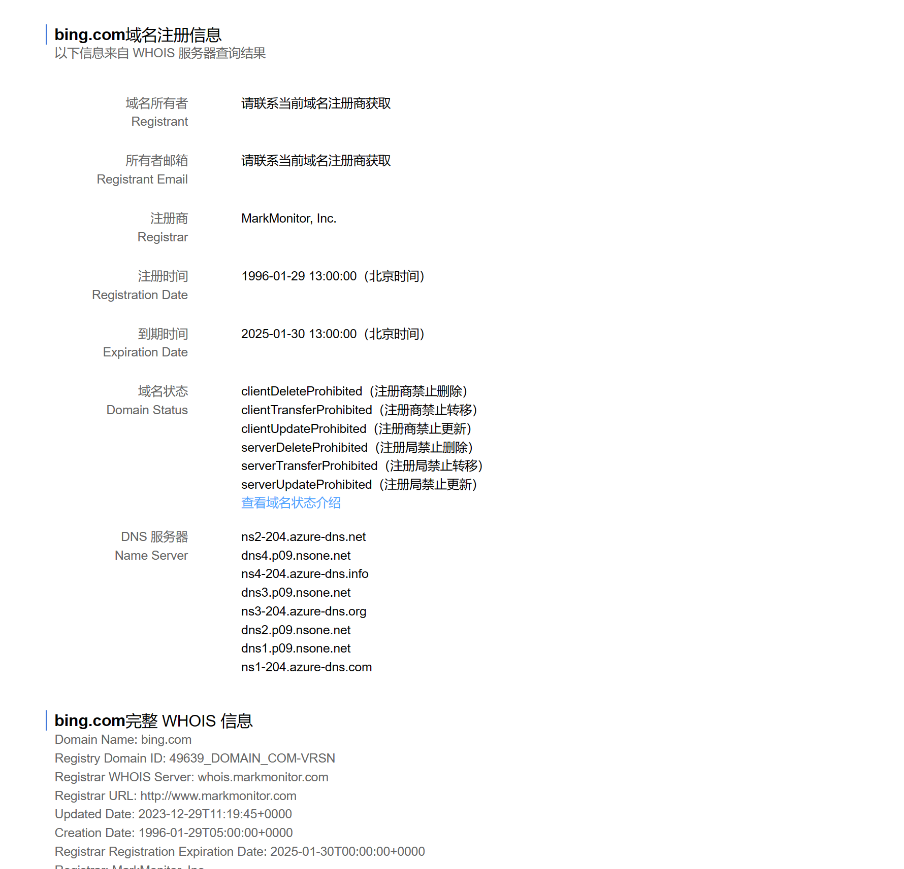
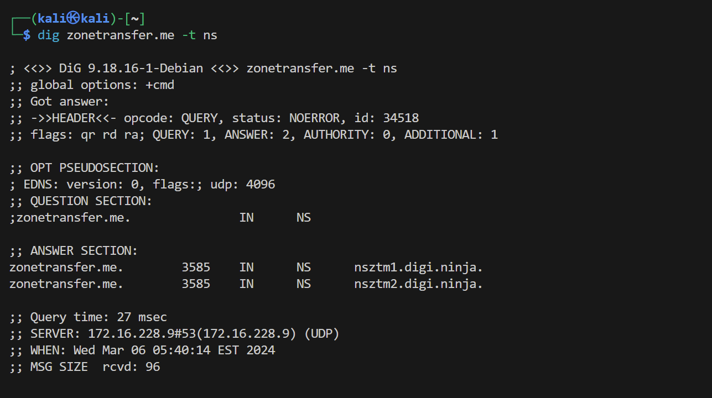
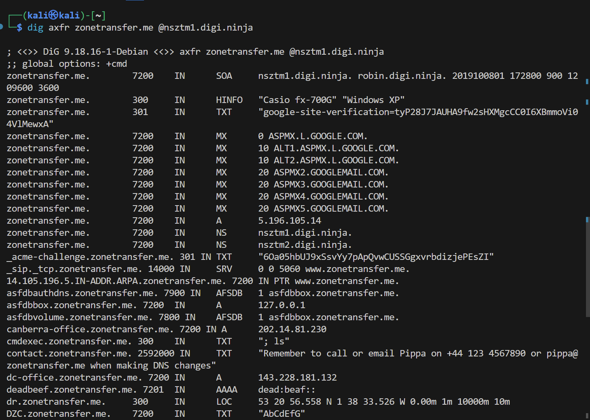
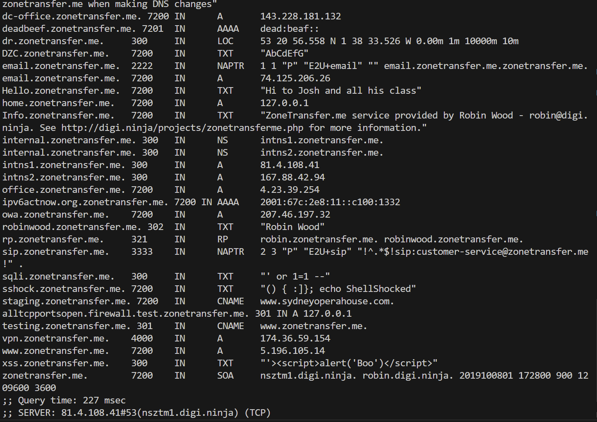
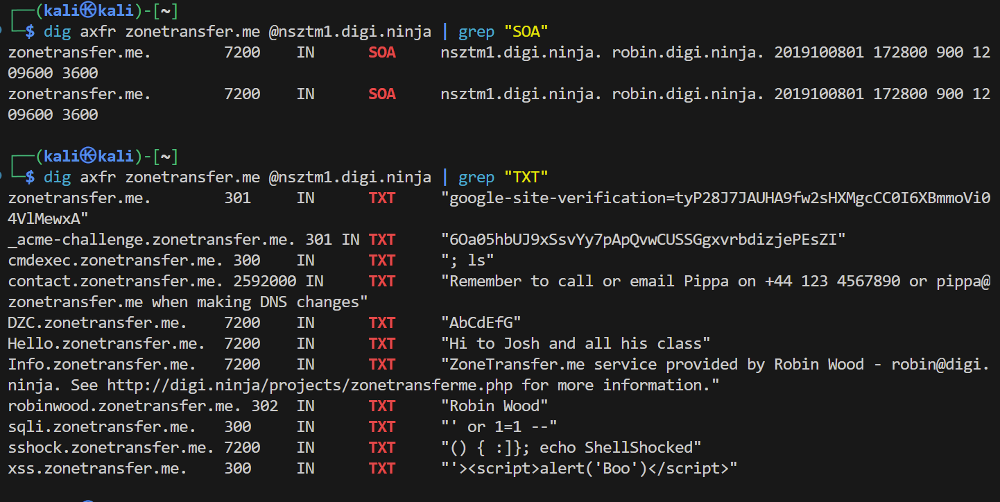
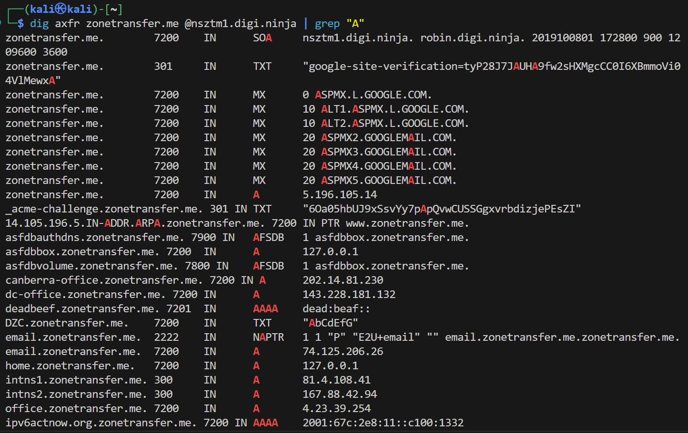
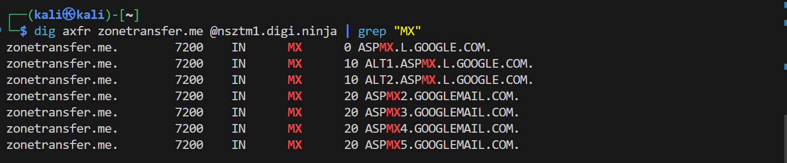
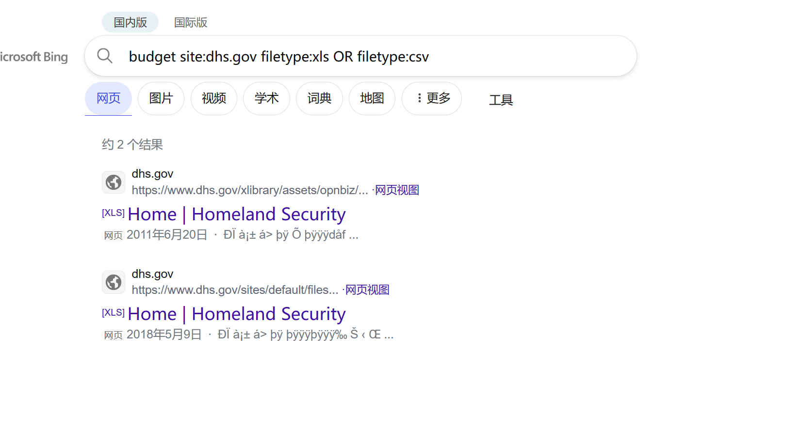
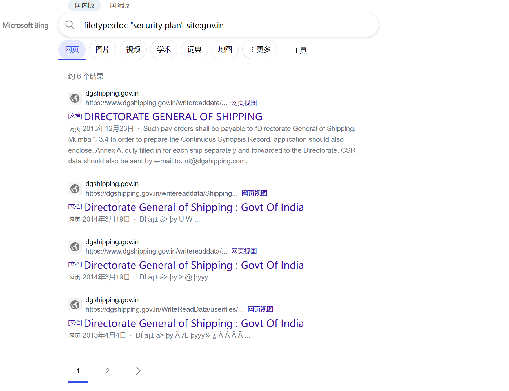

## 实验一
#### 实战：使用WHOIS查询网站，查询以下网站的信息：
`www.baidu.com`
`www.qq.com·`
`www.bing.com`

实验效果如图所示：
1. 查询`www.baidu.com`
2. 
    
    
3. 查询`www.qq.com·`
4. 
    

5. 查询`www.bing.com`
6. 
    

 ## 思考一
#### 1. 使用 `WHOIS` 能够获取哪些信息？
  可以获得“域名所有者”、“所有者邮箱”、“注册商”、“注册时间”、“到期时间”、“域名状态”、“DNS 服务器等信息。
#### 2. 这些信息可能如何被攻击者利用？
  1. 钓鱼攻击：攻击者可以使用 whois 获取到的联系信息发送钓鱼邮件或短信，诱骗用户点击恶意链接或提供个人敏感信息。
  2. 社会工程攻击：通过收集到的联系信息，攻击者可以尝试进行社会工程攻击，如通过电话欺骗、虚假身份验证等方式获取更多敏感信息或越过安全措施。
  3. 恶意网络活动：攻击者可能使用收集到的信息进行网络攻击，如针对特定目标的网络针对性攻击（例如针对公司或个人的网络针对性攻击）。
  4. 身份盗窃：攻击者可以使用 whois 获取到的个人信息进行身份盗窃，如注册虚假账号、伪造文件等。
  5. 定向攻击：收集到的信息可能用于对特定个人或组织进行有针对性的攻击，如恶意软件传播、网络入侵等。
## 实验二
#### 实战：使用 `Dig` 传输 DNS域
  1. 在kali中打开命令⾏终端
  2. 查找示例域名 zonetransfer.me 的 nameservers 
  3. 查看zonetransfer.me的所有 DNS 记录
`dig zonetransfer.me -t ns`对应2.操作

 

`dig axfr zonetransfer.me @nsztm1.digi.ninja`对应3.操作

 

 
 
## 思考二
#### 1.DNS 记录有哪些类型？每一种类型的记录可能包含哪些信息？
* **AAAA记录**
  (AAAA record)是用来将域名解析到IPv6地址的DNS记录。与之相对的A记录只能将域名解析到IPv4地址上，如果需要将域名解析到一个IPv6地址上，就需要添加一条AAAA记录。
* **TXT记录**
 DNS“文本”(TXT) 记录允许域管理员将文本输入到域名系统 (DNS) 中。TXT 记录最初的目的是用作存放人类可读笔记的地方。但是，现在也可以将一些机器可读的数据放入 TXT 记录中。一个域可以有许多 TXT 记录。
* **MX记录**
  邮件记录（Mail eXchange），返回接收电子邮件的服务器地址。
* **A记录**
  址记录（Address），返回域名指向的IP地址。
* **NS记录**
  域名服务器记录（Name Server），返回保存下一级域名信息的服务器地址。该记录只能设置为域名，不能设置为IP地址。
* **SOA记录**
  域名服务器记录（Name Server），返回保存下一级域名信息的服务器地址。该记录只能设置为域名，不能设置为IP地址。
* **HINFO记录**
  用来说明映射到特定 DNS 主机名的 CPU 类型和操作系统类型的 RFC-1700 保留字符串类型，这个信息可以被应用程序通信协议使用。
* **SRV记录**
  DNS“服务” (SRV) 记录为特定的服务（如 IP语音 (VoIP)）、即时通讯等）指定主机和端口。大多数其他 DNS 记录只指定一个服务器或一个 IP 地址，但 SRV 记录还包括该 IP 地址的一个端口。一些互联网协议需要使用 SRV 记录才能运作。
* **LOC记录**
  “位置”记录包含经度和纬度坐标形式的域的地理信息
* **RP记录**
  这是“respo**nsible person”“负责人”记录，它存储负责该域的人员的电子邮件地址。
* **CNAME记录**
  规范名称记录（Canonical Name），返回另一个域名，即当前查询的域名是另一个域名的跳转。
* **NAPTR记录**
  “name authority pointer”、“域名权限指针”记录可以与SRV记录组合，以基于正则表达式动态创建指向的URI。
#### 2.  以`zonetransfer.me`为例，找出其中的所有 DNS 记录类型和对应类型下的所有记录有哪些？
* 如图所示等
  

#### 3. 以`zonetransfer.me`为例，在其结果中，能够找到哪些敏感信息？可能会有哪些潜在影响？
ip地址、域名、邮箱、电话等敏感信息，可能会导致被钓鱼攻击或被找到网站漏洞使网站遭到破坏。
#### 4. 如何防范 DNS 域传输漏洞？
  1. 限制域传输权限：在DNS服务器配置中，应该限制域传输权限，仅允许授权用户或特定IP范围执行域传输操作。
  2. 更新DNS服务器软件：确保DNS服务器软件是最新版本，以便及时修复任何已知的域传输漏洞。
  3. 使用防火墙和入侵检测系统：在网络边界和内部部署防火墙和IDS，以监控和阻止恶意域传输尝试。
  4. 启用DNSSEC：DNSSEC可以提供DNS数据的完整性和身份验证，减少DNS欺骗和篡改的风险。
  5. 实施访问控制策略：限制对DNS服务器的物理和逻辑访问，只允许授权用户或管理员进行访问。
  6. 网络隔离：将DNS服务器放置在网络安全边界内部，并将其与其他关键系统隔离开来，以减少潜在的攻击面。此外，应该限制DNS服务器与外部网络的通信，仅允许与所需的DNS查询和响应进行通信。
## 实验三：`Google Hacking` ——如何更高效地使用搜索引擎？
  #### `dorking` 实战1 —— 在美国国土安全部网站上查找预算
  `budget filetype:xls`

  

  `budget filetype:xlsx OR filetype:csv`

  

  `budget site:dhs.gov filetype:xls OR filetype:csv`

  

  #### `dorking` 实战2 —— 伦敦房价
  `filetype:xls "house prices" AND "London"`

  

  #### `dorking` 实战3 —— 查找印度政府的安全计划
  `filetype:doc "security plan" site:gov.in`

  
  #### `dorking` 实战4 —— 查找某大学学生学号

  `intext:"学号" filetype:pdf site:cuc.edu.cn`

  
  
## 思考三
#### 1. 请整理常见的 `dorking`关键词及其含义，数量不少于10个
  1. ntitle:按标题搜索
  2. inurl:链接搜索返回那些网址url里面包含你指定关键词的页面
  3. site:指定域名
  4. filetype:指定文件类型即后缀搜索
  5. intext:寻找页面内容指定的关键字
  6. Index of:以目录浏览的web网站
  7. phonebook:查询美国街道地址和电话号码信息
  8. intitle用于搜索页面标题中包含特定字符串的网页，如 intitle:index of 可以搜索标题中包含 "index of" 的网页，通常用于寻找目录索引。
  9. ext:用于搜索特定文件扩展名的关键词，如 ext:php 可以搜索 PHP 文件。
  10. cache:用于查看搜索引擎的缓存页面，有时可以获取到被删除或修改的信息。
  11. link:用于搜索包含特定URL的页面，如 link:example.com 可以搜索包含指向 example.com 的链接的页面。
  12. related:用于搜索与特定网站相关的其他网站，如 related:example.com 可以搜索与 example.com 相关的其他网站。
#### 2. 请在 Google Hacking Database (GHDB) 中查找 5 条前缀运算符不少于 3 个的 dork 示例，并解释对应 dork 的含义。
* `intext:"PMB" AND ("changelog.txt" OR inurl:opac_css)`
查找带有关键字“PMB”并且有changelog.txt文件且在url中有opac_css关键字的网
* `intext:"userfiles" intitle:"Index Of" site:*.com.*`
查找域名为.com下的标题中有以目录浏览web且页面内容中带有"userfiles"的网站
* `intext:"user" filetype:php intext:"account" inurl:/admin`
查找内容中含有"user""account",文件类型为.php且网站url中含有指定关键词"/admin"的网站
* `intitle:"phpinfo" site:*.com.* intext:"HTTP_HOST"`
查找网页内容中含有"HTTP_HOST"，标题中含有"phpinfo"且域名为以.com结尾的网站
* `intitle:"Index of" intext:"config" site:*.com.*`
查找标题中有目录列表，网页内容中有"config"且域名为以".com"结尾的网站
#### 3. 请发挥你自己的脑洞，还能进行哪些搜索语法的组合，实现在搜索引擎中实现你的既定目标？
`filetype:pdf intitle:"就业" site:cuc.edu.cn`
查询中国传媒大学就业情况的PDF文件
`site:example.com filetype:docx "password"`
查找某一网站可能泄露的密码信息
`filetype: xls OR csv intext:"年龄" intitle:国企 site *.cn*`
查询国企中工作人员的年龄信息表格
#### 4. 扩展：可借助搜索引擎，思考如何利用 `dorking` 辅助查找漏洞相关信息？
利用特定的关键字和语法查找与特定的文件类型、特定网站域名等相关的漏洞信息。
通过搜索泄露数据库、文件共享站点或论坛上的贴子，这些数据泄露可能包含漏洞信息或系统配置的详细信息。
搜索公开的安全论坛、漏洞公告网站或社交媒体上的漏洞报告和讨论。
利用搜索引擎查找特定版本的软件或服务的已知漏洞以发现系统中存在的潜在漏洞，从而加强安全性。
部分例子如下：
`intitle:"index of" intext:shell`
查找包含“shell”（后门）关键字的目录，可能存在恶意文件或后门程序。

