## 实验一
### 使用 Hashcat 进行 Hash 破解
1. 构建 md5 hash 样本
   为`"12345678"`⽣成⼀个hash值，并存储在passwd.hash⽂件中

   
 
   查看 passwd.hash ⽂件内容

   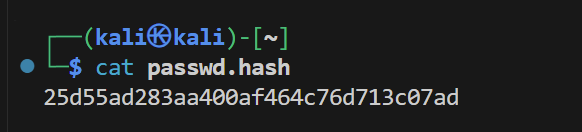
  
1. 准备⼀个常⽤字典
   现将原文件复制到当前路径下

   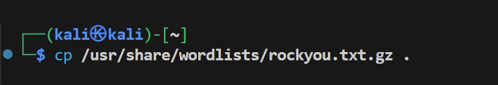

   将复制的压缩包进行解压缩

   

2. 使⽤ `hashcat` 破解哈希值。`-m 0` 指定 MD5 算法。` -a 0` 指定攻击模式
为字典
    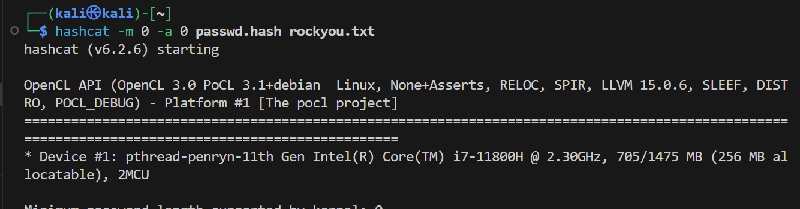
    
    执行后发现报错，分析后发现是分配给虚拟机的内存过少

    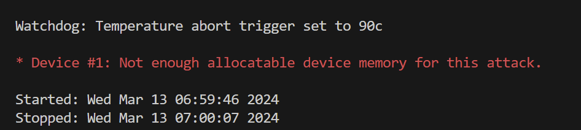

    重新进行分配内存至4G

    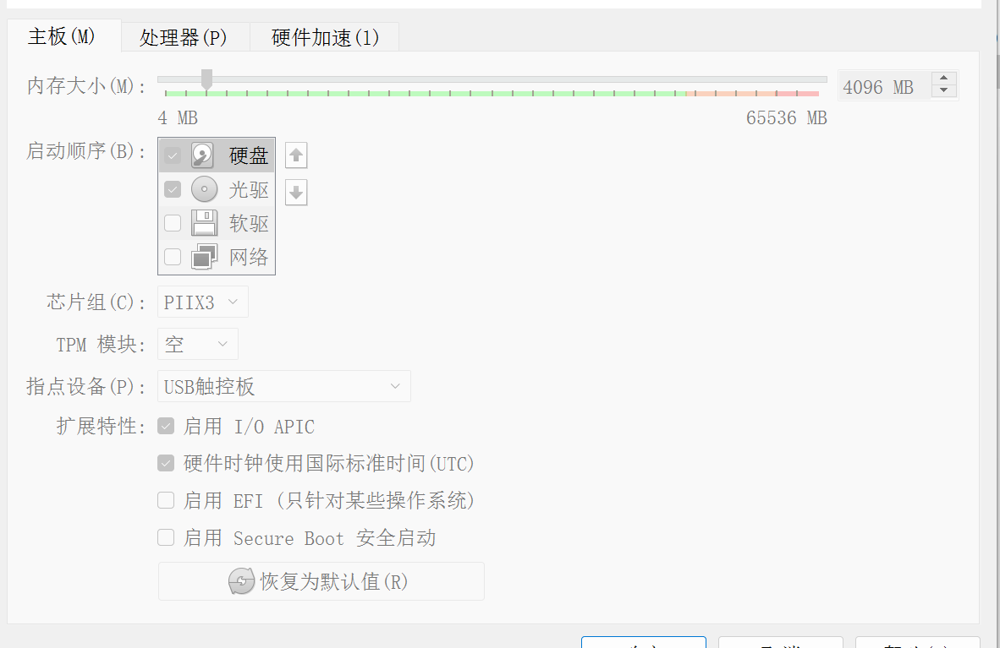

    成功破解

    

## 思考一
#### 1. 在Hashcat 的⼀些常⻅使⽤示例一节中，每一种攻击模式（Attack-Mode）的含义是什么？分别可以处理什么情况下的问题？
* `Wordlist`为字典破解模式，适用于用户使用常见单词、短语或密码的情况。
* `Wordlist + Rules` 为字典加掩码破解模式，适用于用户使用常见单词、短语或密码且已经知道密码的大致分部情况，如格式等。
* `Brute-Force`为使用指定掩码破解模式，适用于已知密码的部分信息和密码遵循的特定规律，可以提高破解的效率。
* `Combinator`为将字典中的密码进行组合破解模式，适用于用户使用多个单词组合或者密码规则的情况。

#### 2. 对于`Brute-Force`这种攻击模式，当知道目标密码的特定格式后，应该如何构建 `Hashcat` 的参数和语法？请给出一个合理的示例格式，并针对这种示例格式给出对应的 `Hashcat` 命令。
`hashcat -a [X] {HASH文件} 掩码`
如密码格式为三个小写字母和5个数字组成
则可使用的hashcat命令为：
`hashcat -a[3] hashfile.txt ?l?l?l?d?d?d?d?d`
 

## 实验二
### 使用`John the Ripper` 进行实战破解

#### 1. 破解加密的ZIP文件
1. 创建⽬录及其中的⽂件
   
    

2. 创建⼀个带密码的压缩包
   
   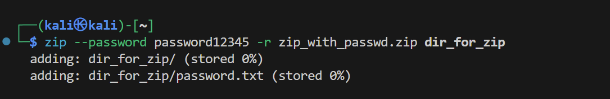

3. 计算 ZIP ⽂件密码的哈希值，并将其存储在 `zip.hashes` ⽂件中。
   
   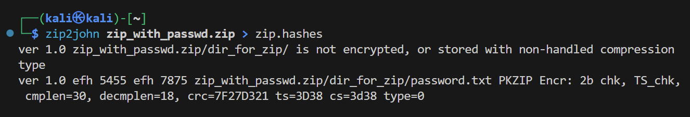

4. 使⽤ `Single Crack Mode` 破解密码

   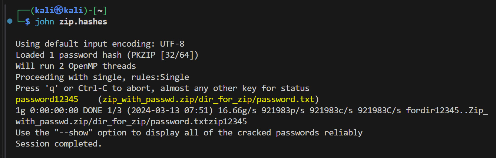

5.  清除john破解历史记录
   
   

6.  使⽤ RockYou 字典破解密码
   
   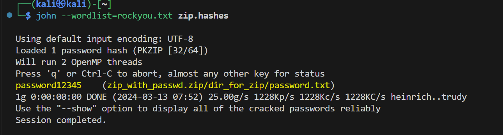

#### 2. 破解 Linux 密码
1. 在 Kali Linux 上创建⼀个新⽤户

   

2.  给新⽤户⼀个弱密码，例如 `password123`
   
   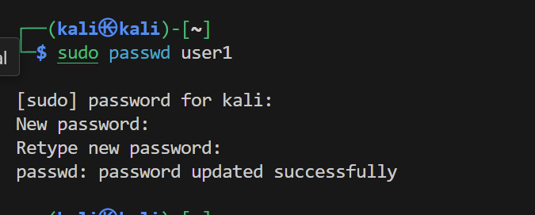 

3.  为所有⽤户 Unshadow Linux系统的密码哈希，存储到`lin.txt`⽂件中
   
    

    执行命令后发现权限不足，对指定目录提高权限

   

   

4.  仅将新⽤户的⽤户名和密码导出到新⽂件 (`lin1.txt`)
   
   

5.  使⽤`john`破解密码
   
   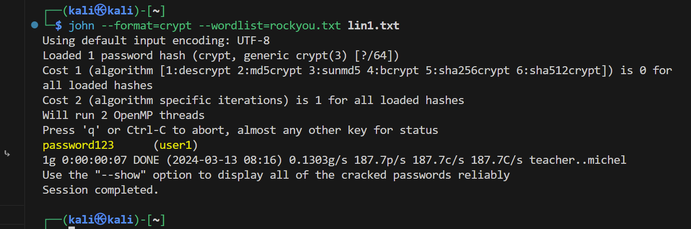

6.  清理新⽤户user1
   
   

## 思考二
#### 1.在实验破解加密的 ZIP ⽂件中，如果知道密码是8位数字，应该如何使用John the Ripper 进行破解？

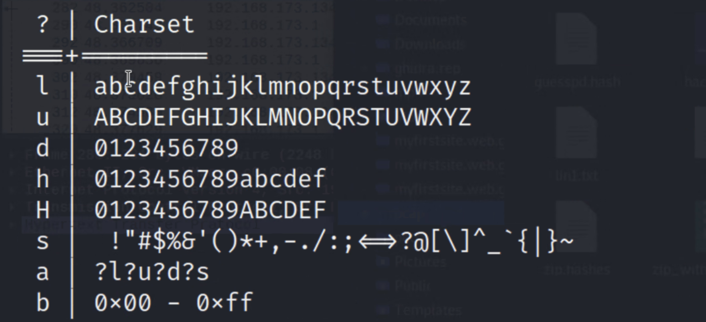

如图，d表示数字
故可写命令：
`john --mask=?d?d?d?d?d?d?d?d hashfile.txt`

#### 2.如何使用 John the Ripper 破解加密的 PDF 文件?
先用工具提取PDF文件的哈希值，再使用john对哈希文件进行破解
如可以使用如下命令提取hash值：
`pdf2john encrypted.pdf > hashfile.txt`
然后再使用正常的john命令进行破解。

#### 3.  扩展：使用 John the Ripper 完成 n00bzCTF2023 的题目 Crack & Crack
使用如第二步中的方式：
1. 先使用zip2john获取zip文件的hash值，并使用john对hash文件进行破解得到密码
   
   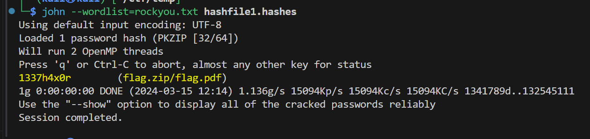

2. 使用密码解压缩后发现里面是一个加密的PDF文件
   
   

3. 为将PDF文件解密，先使用pdf2john生成pdf文件的hash文件
   
   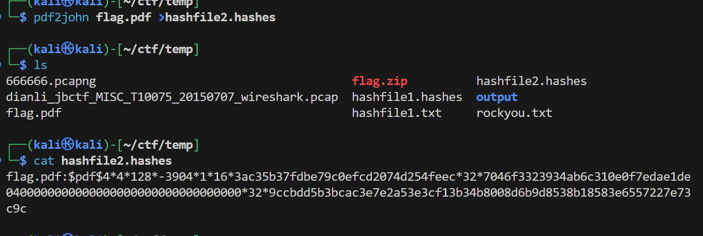

4. 同理使用john对hash文件进行破解得到密码
   
   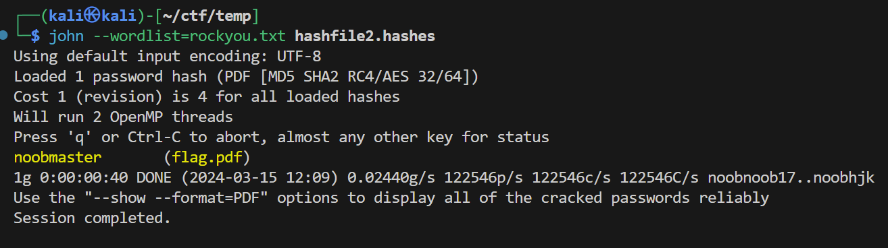

5. 使用密码打开pdf文件得到flag
   
   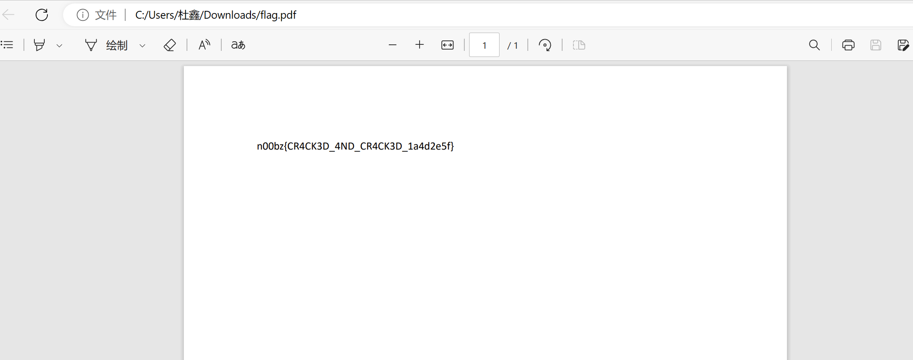