# 第三章：基于容器技术的渗透测试靶场环境构建
## 实验一
1. 添加 Docker 官⽅源
   ```bash
    echo "deb [arch=amd64 signed-by=/etc/apt/keyrings/docker.gpg] 
    https://download.docker.com/linux/debian bookworm stable" | \
    sudo tee /etc/apt/sources.list.d/docker.list    
   ```

    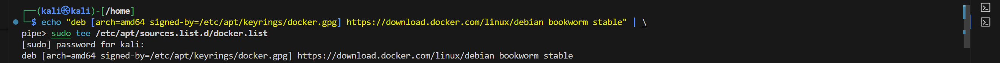

2. 导⼊ gpg 密钥
   ```bash
    sudo mkdir -p /etc/apt/keyrings
    curl -fsSL https://download.docker.com/linux/debian/gpg |
    sudo gpg --dearmor -o /etc/apt/keyrings/docker.gpg
    ```

     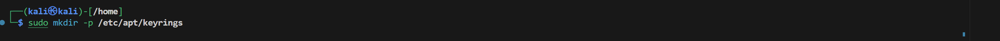

     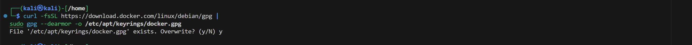
   
3. 安装最新版本的 docker-ce
   ```bash
    sudo apt update
    sudo apt install -y docker-ce docker-ce-cli containerd.io
    ```

    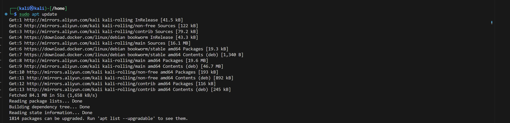

    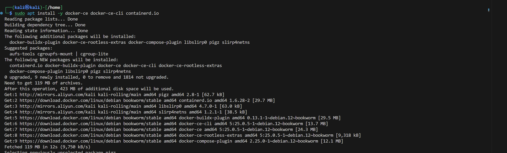
    
4. 添加 Docker 服务开机⾃启动
   ```bash
    sudo systemctl enable docker --now
    ```

    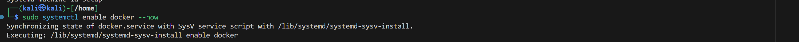

5. 将⾃⼰添加到 docker 组以使⽤ docker ⽽不使⽤ sudo
   ```bash
   sudo usermod -aG docker $USER
   ```

    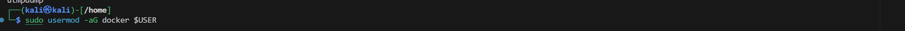

6. 重新登录或切换⽤户组：为了⽴即⽣效，可以执⾏以下命令
   ```bash
   newgrp docker
   ```

    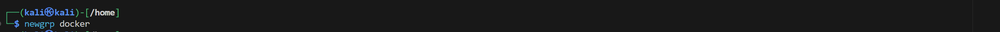

7. 重启 docker 服务
   ```bash
   sudo systemctl restart docker
   ```

    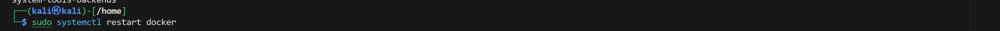

8. 验证 Docker 已经安装成功
   ```bash
   sudo docker run hello-world
   ```

    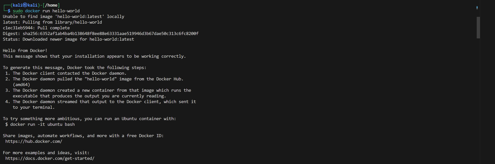

## 实验二
1. 使⽤ docker pull 命令从镜像仓库拉取镜像
   ```bash
   docker pull ubuntu
   ```

    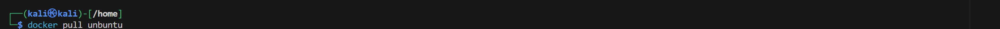

2. 列出本地镜像
   ```bash
   docker images
   ```

    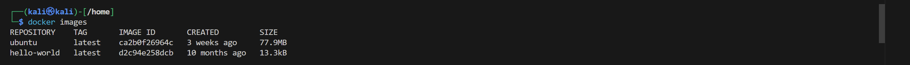


3. 查看镜像信息
   ```bash
   docker inspect ubuntu
   ```

    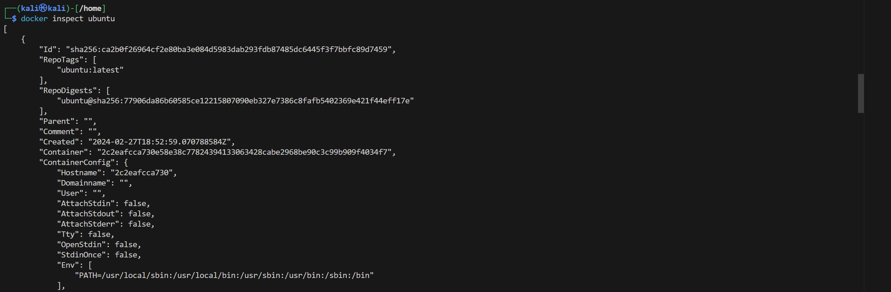


4. 创建⼀个放在后台运⾏的容器
   ```bash
   docker run -i -t -d ubuntu /bin/bash
   ```

    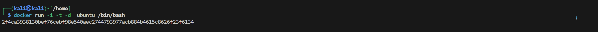


5. 列出正在运⾏的容器
   ```bash
   docker ps
   ```

    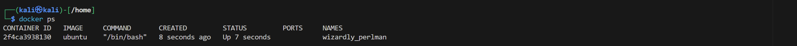


6. 停⽌刚刚创建的容器
   ```bash
   docker stop my_container
   ```

    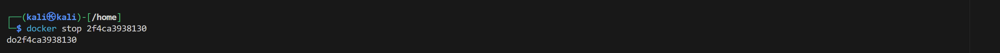


7. 启动已停⽌的容器
   ```bash
   docker start my_container
   ```

    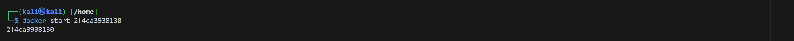


8. 查看容器⽇志
   ```bash
   docker logs my_container
   ```

    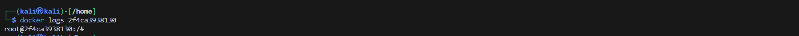


9.  进⼊容器的 shell
    ```bash
    docker exec -it my_container /bin/bash
    ```

    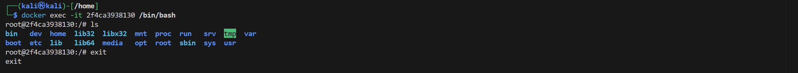
    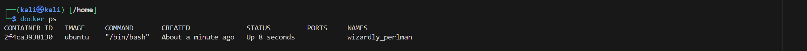

    
10. 查看容器信息
    ```bash
    docker inspect my_container
    ```

    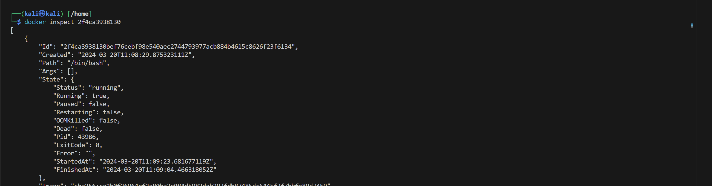


11. 删除容器
    ```bash
    docker rm my_container
    ```

    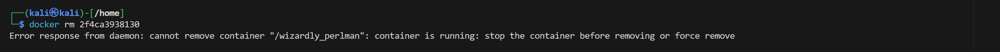
 删除失败，发现是没有停止容器

    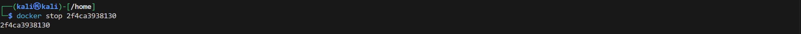
停止容器后再进行删除操作，删除成功

    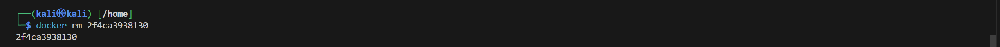


## 实验三
#### 步骤一：下载应用程序源代码
1. clone 应⽤程序源代码
   ```bash
   git clone https://github.com/docker/getting-started-app.git
   ```

   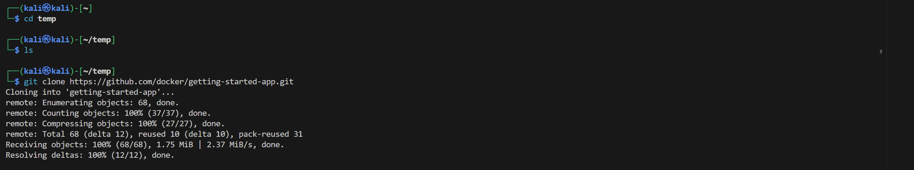

2. 查看⽬录结构
   ```bash
   cd getting-started-app
   ls -al
   ```

   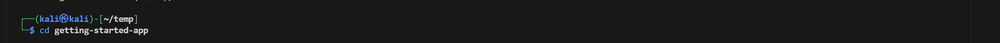

   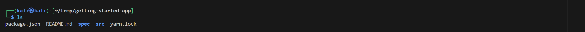

   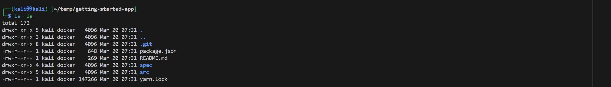

#### 步骤二：构建应用程序镜像
1. 在 getting-started-app 目录中与 package.json 文件相同的位置，创建一个名
为 Dockerfile 的文件。
    ```bash
    touch Dockerfile
    ```
   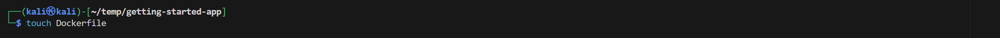

2. 使用文本编辑器或代码编辑器，将以下内容添加到 Dockerfile 中
   ```bash
    # syntax=docker/dockerfile:1
    FROM node:18-alpine
    WORKDIR /app
    COPY . .
    RUN npm install -g node-gyp
    RUN yarn install --production
    CMD ["node", "src/index.js"]
    EXPOSE 3000
   ```
   这里使用vim将上述代码写入Dockerfile文件

   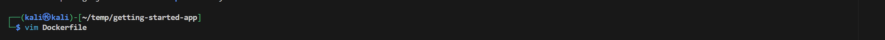

   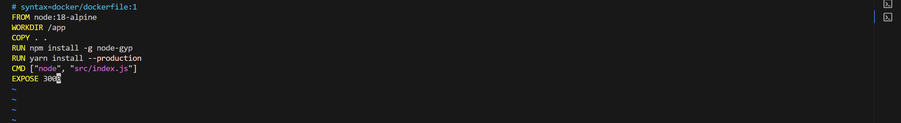
   
3. 在终端中，确保位于 getting-started-app 目录中。
   
   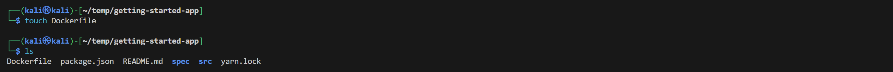

4. 构建镜像
   ```bash
    docker build -t getting-started .
   ```

   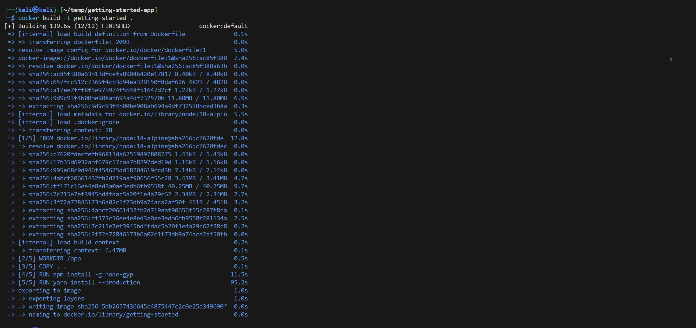

#### 步骤三：启动应用程序容器
1. 使用 docker run 命令运行容器并指定刚刚创建的映像的名称：
   ```bash
   docker run -dp 127.0.0.1:3000:3000 getting-started
   ```

   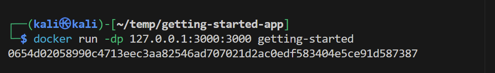

   检查镜像是否已经创建成功

   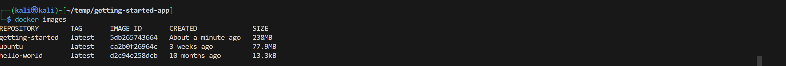

1. 几秒钟后，打开 Web 浏览器访问 http://localhost:3000。应该会看到你的应用程序

    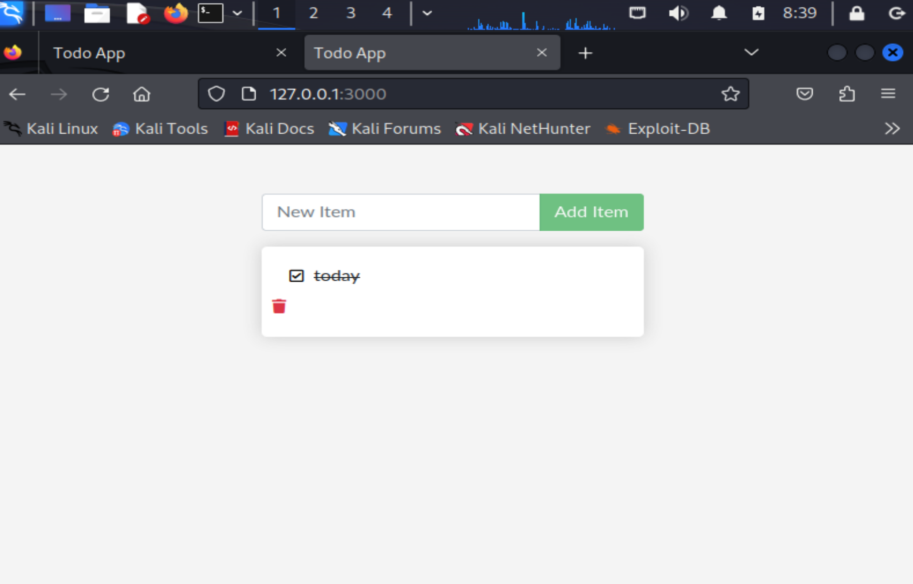   

   可以在终端中查看正在运行的镜像的情况

    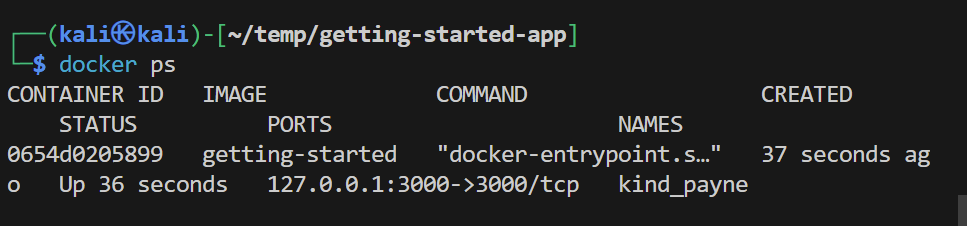

1. 添加一两个项目，看看它是否按你的预期工作。你可以将项目标记为完成
并将其删除。你的前端已成功将项目存储在后端。

   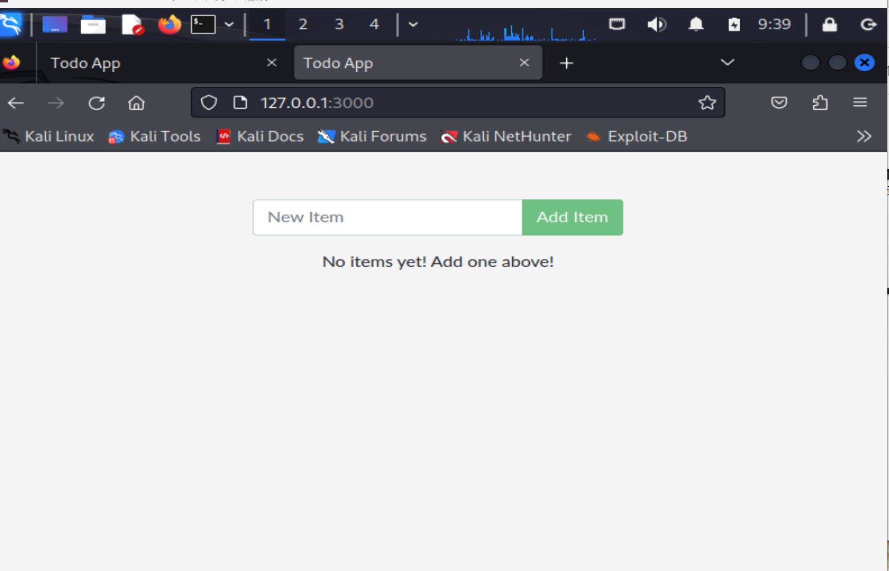

1. 在终端中运行以下 docker ps 命令以列出容器
   
   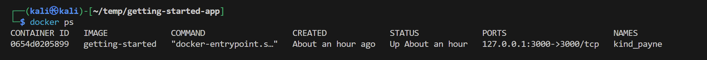