# 第三章：基于容器技术的渗透测试靶场环境构建
### 更新 Docker 镜像
1. 更新源代码   
   ```
   在src/static/js/app.js中，修改第 56 行以使用新的空文本。
   - <p className="text-center">No items yet! Add one above!</p>
   + <p className="text-center">You have no todo items yet! Add
    one above!</p>
    ```
    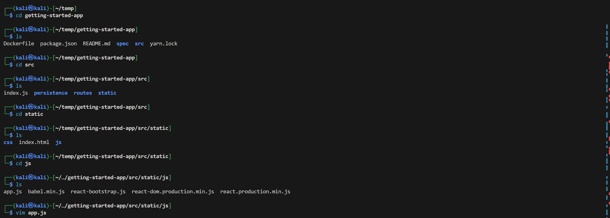
    ```
    # 2. 使⽤命令 docker build ⽣成镜像的更新版本
    docker build -t getting-started .
    # 3. 使⽤更新的代码启动新容器
    docker run -dp 127.0.0.1:3000:3000 getting-started
   ```
   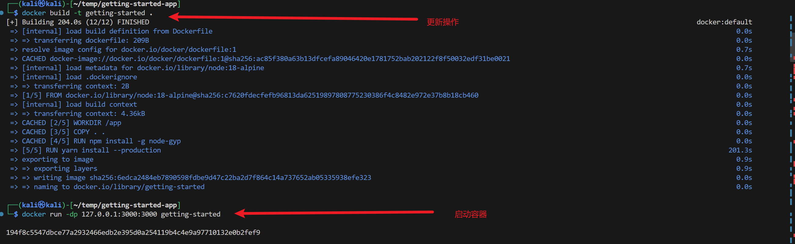
2. 移除旧的容器
   ```
    # 1. 使⽤ docker ps 命令获取容器的 ID。
    docker ps
    # 2. 使⽤命令 docker stop 停⽌容器。替换 <the-container-id> 为 中
    的 docker ps ID。
    docker stop <the-container-id>
    # 3. 容器停⽌后，可以使⽤命令 docker rm 将其删除。
    docker rm <the-container-id>
   ```
   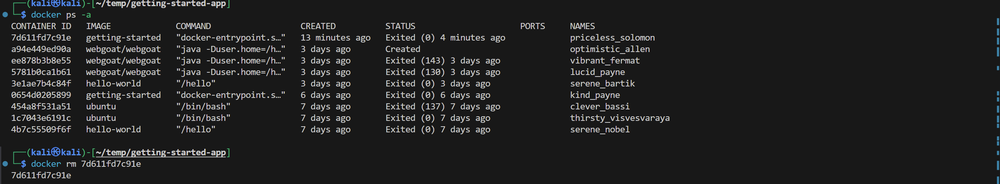
3. 启动容器
   ```
    # 1. 使⽤命令 docker run 启动更新的应⽤程序。
    docker run -dp 127.0.0.1:3000:3000 getting-started
    # 2. 在 http://localhost:3000 上刷新浏览器，可以看到更新的帮助⽂本。

   ```
   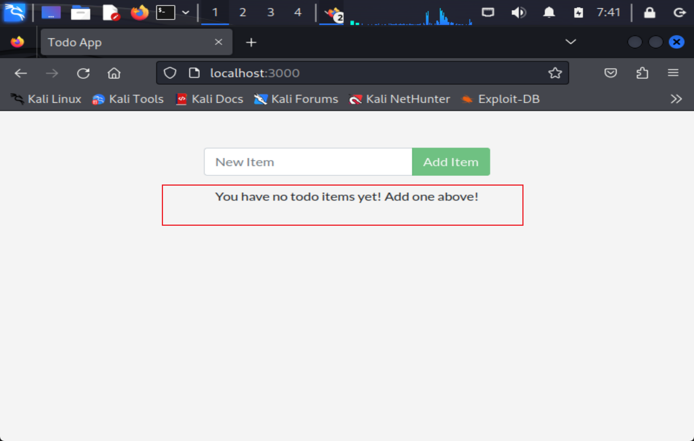
### 实验一：在 Harbor 上分享镜像
#### 步骤一：在本地构建 Harbor 镜像仓库
   1. 首先下载dcoker-compose
   
   2. 然后下载harbor的压缩包
   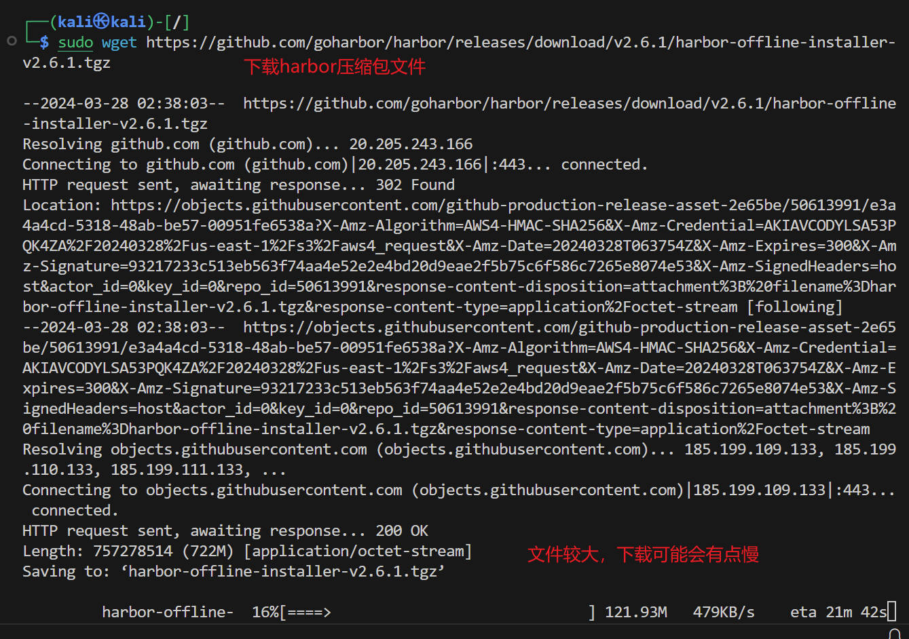
   3. 下载完成后进行解压缩
   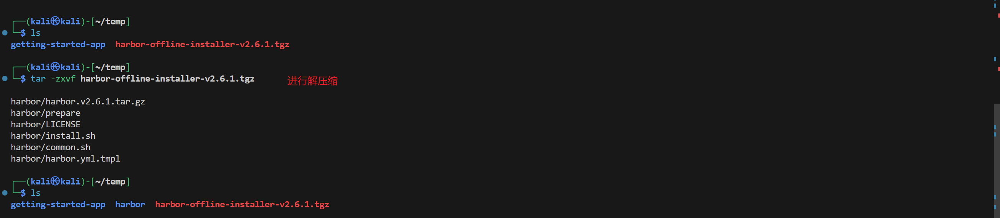
   4. 进入目标目录并修改文件当中部分内容，如ip地址和端口号等
   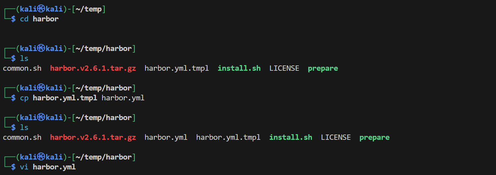
   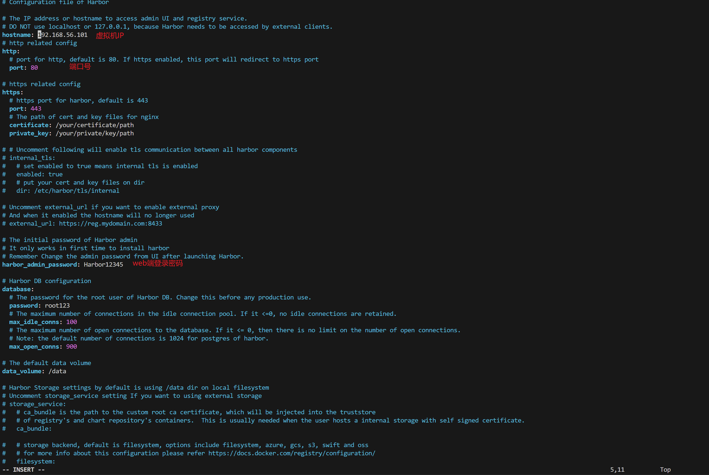
   5. 在目录下运行install进行harbor部署
   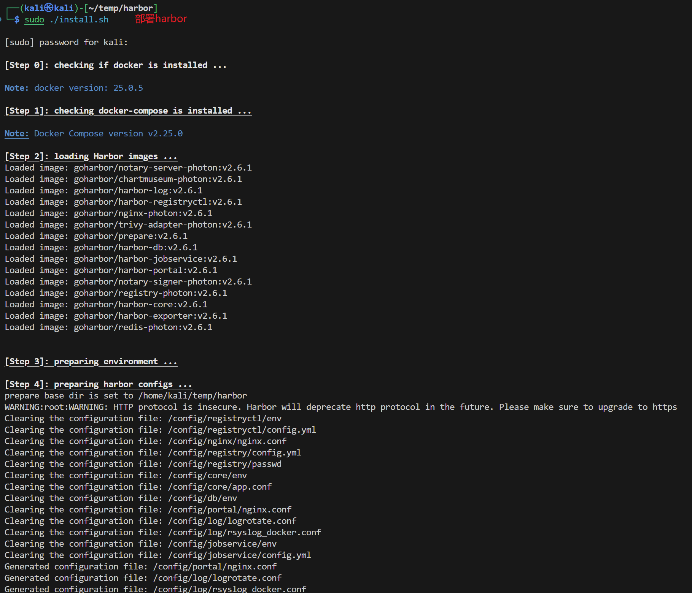
   6. 如果出现以下报错，可以直接在配置文件中注释调https相关的内容来解决
   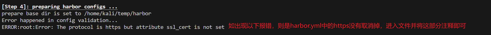
   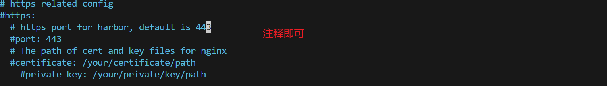
   7. 处理完报错后完成部署
   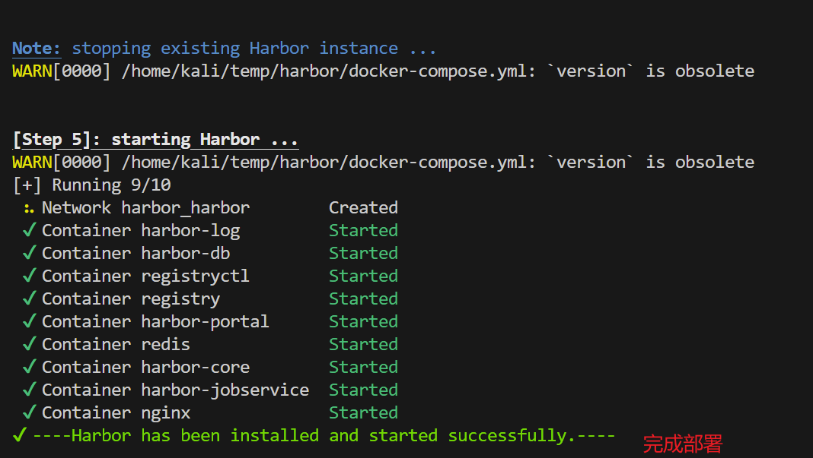
#### 步骤二：向构建好的Harbor仓库推送镜像
```
   # 1. 使⽤命令 docker login -u YOUR-USER-NAME 登录到 Harbor。
   docker login -u YOUR-USER-NAME
```
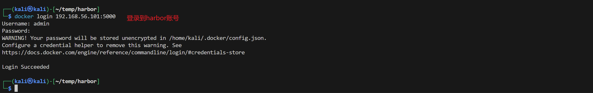
```
   # 2. 使⽤ docker tag 命令为 getting-started 映像指定⼀个新名称。替
   换 YOUR-USER-NAME 为你的 Docker ID。
   docker tag getting-started YOUR-USER-NAME/getting-started
   # 3. 再次运⾏ docker push 命令。如果没有向镜像名称添加 tag，则
   Docker 使⽤ latest 作为标记。
   docker push YOUR-USER-NAME/getting-started
```
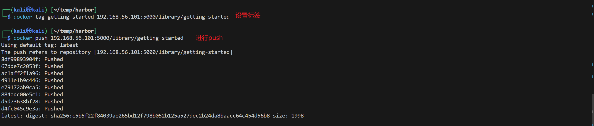
当然可以在web端登录并查看push的镜像：
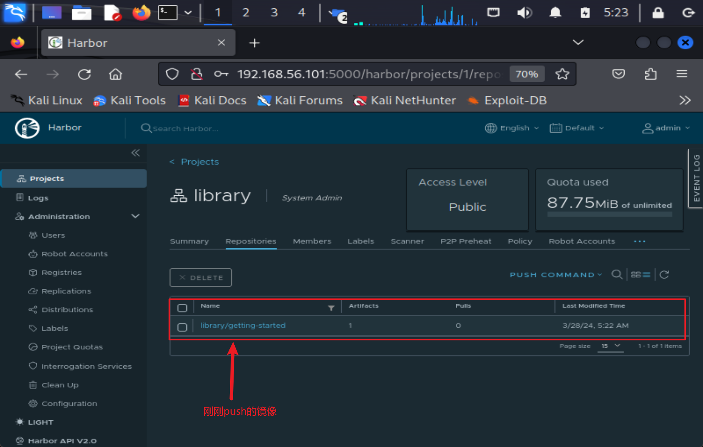
```
# 4. 运⾏你账户下的镜像
   docker run -dp 0.0.0.0:3000:3000 YOUR-USER-NAME/getting-started
```
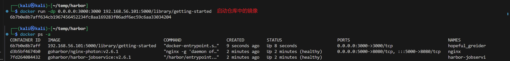


### 实验二：查看并理解容器的文件系统


#### 步骤一：理解容器之间文件系统的相互隔离
```
# 1. 启动⼀个 Alpine 容器并访问其 shell。
docker run -it --name=mytest alpine
# 2. 在容器中，创建⼀个 greeting.txt 包含 hello inside.
# 请结合上节课内容思考，如何进⼊到刚刚创建的容器中？
/ # echo "hello" > greeting.txt
# 3. 退出容器。
/ # exit
```
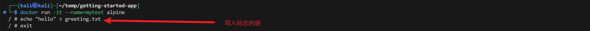
```
# 4. 运⾏新的 Alpine 容器，并使⽤该 cat 命令验证该⽂件是否不存在。
docker run alpine cat greeting.txt
# 应会看到类似于以下内容的输出，该输出指示新容器中不存在该⽂件。
# cat: can't open 'greeting.txt': No such file or directory
```
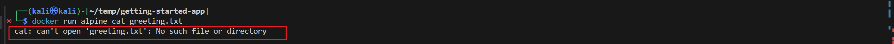
```
# 5. 继续删除刚刚的容器。
# 查看所有容器的id
docker ps --all
# 删除刚刚创建的容器
docker rm -f <container-id>
```
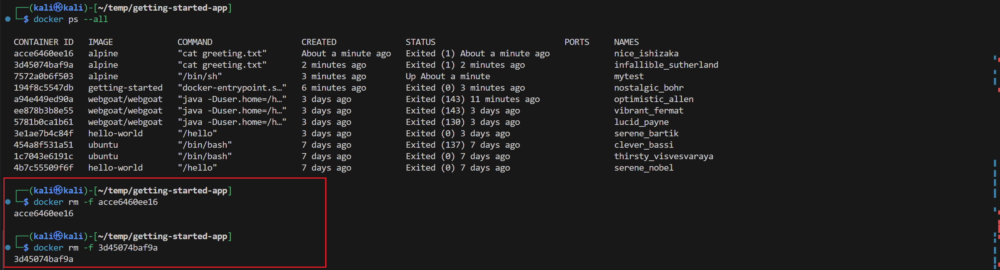
#### 步骤二：持久化存储容器中的数据库文件
```
# 1. 使⽤命令 docker volume create 创建卷。
docker volume create todo-db
```
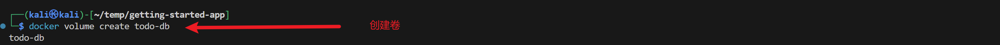
```
# 2. 再次停⽌并删除 TODO 应⽤容器，因为它仍在运⾏⽽不使⽤持久卷。
docker rm -f <id> todo
```
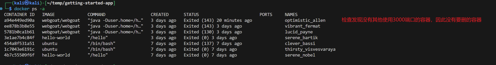
```
# 3. 启动 TODO 应⽤容器，但添加⽤于指定卷装载 --mount 的选项。为卷命
名，并将其装载到 /etc/todos 容器中，该容器将捕获在路径上创建的所有⽂件。
docker run -dp 127.0.0.1:3000:3000 --mount
type=volume,src=todo-db,target=/etc/todos getting-started
```
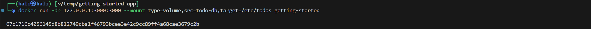
#### 步骤三：验证数据是否持久化存储
```
# 1. 容器启动后，打开应⽤程序并将⼀些项⽬添加到待办事项列表中。
```
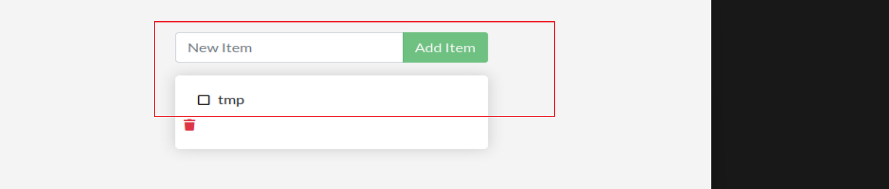
```
# 2. 停⽌并删除待办事项应⽤的容器。 使⽤ docker ps 获取 ID，然后
docker rm -f <id> 将其删除。
# 3. 使⽤前⾯的步骤启动新容器。
```
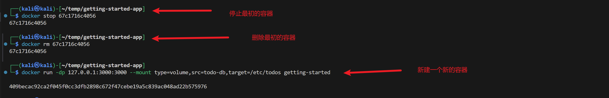
```
# 4. 打开应⽤程序。检查新添加的数据是否仍然在列表中。
```

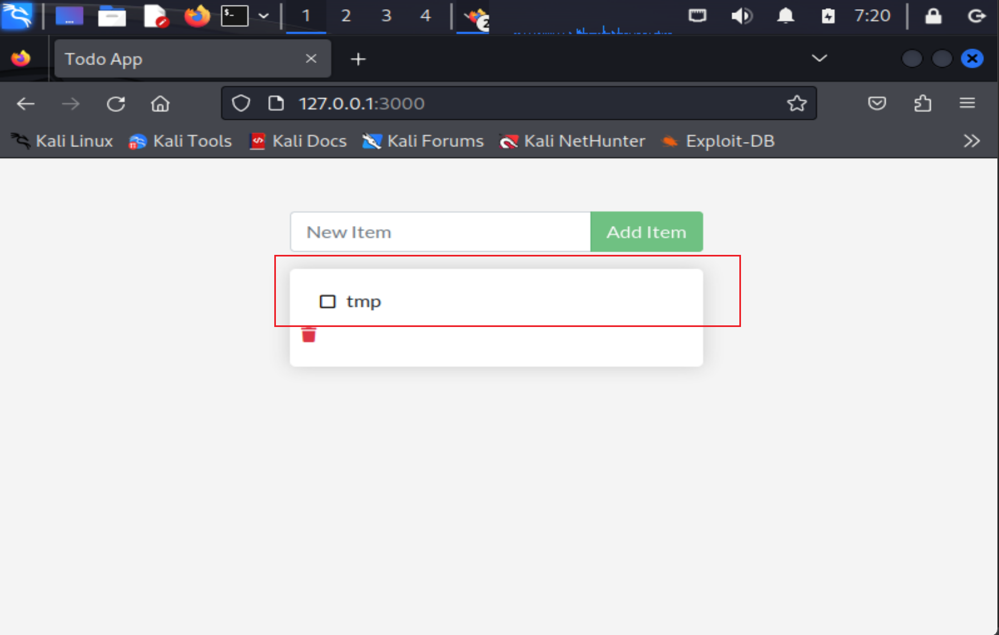
```
# 5. 确认完之后，请删除容器。
```
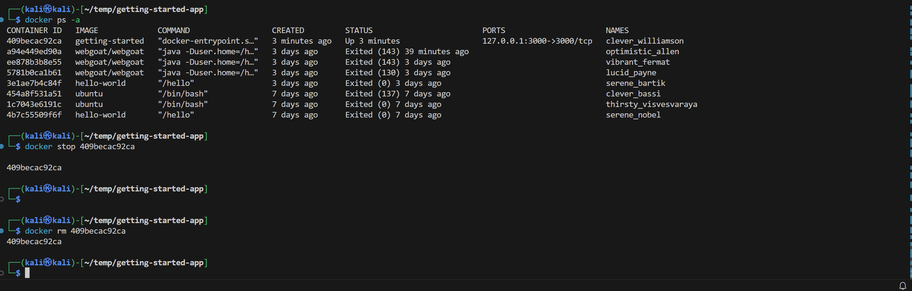
### 实验三：使用绑定挂载
#### 步骤一：体验绑定挂载的效果
```
# 1. 验证 getting-started-app ⽬录是否位于 Docker Desktop 的⽂件共
享设置中定义的⽬录中。此设置定义了可以与容器共享⽂件系统的哪些部分。有关访问该设置的
详细信息，
# 2. 打开终端并将⽬录切换为 getting-started-app ⽬录。
# 3. 运⾏以下命令，在具有绑定挂载的 ubuntu 容器中启动 bash。
docker run -it --mount type=bind,src="$(pwd)",target=/src
ubuntu bash
```
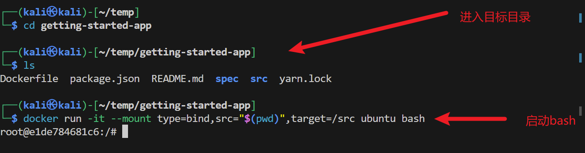
```
# 该 --mount type=bind 选项告诉 Docker 创建⼀个绑定挂载，其中 src
是主机上的当前⼯作⽬录 （ getting-started-app ）， target 并且是该⽬录应出现在
容器 （ /src ） 中的位置。 
# 4. 运⾏命令后，Docker 会在容器⽂件系统的根⽬录中启动交互 bash 式会
话。
root@ac1237fad8db:/# pwd
# /
root@ac1237fad8db:/# ls
```
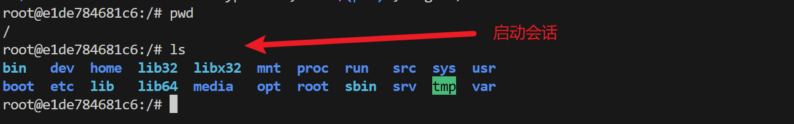
```
# bin dev home media opt root sbin srv tmp var
# boot etc lib mnt proc run src sys usr
# 5. 将⽬录更改为 src ⽬录。
# 这是在启动容器时挂载的⽬录。列出此⽬录的内容将显示与主机上⽬录
getting-started-app 中的⽂件相同的⽂件。
root@ac1237fad8db:/# cd src
root@ac1237fad8db:/src# ls
# Dockerfile node_modules package.json spec src yarn.lock
```
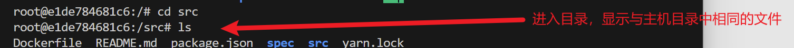
```
# 6. 创建⼀个名为 myfile.txt 的新⽂件。
```
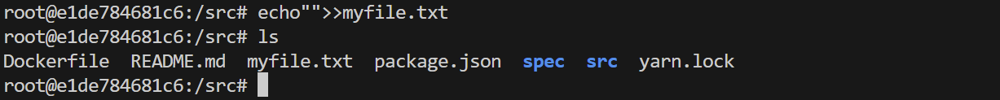
```
# 7. 打开主机上的 getting-started-app ⽬录，并观察 myfile.txt ⽂件
是否在⽬录中。
# ├── getting-started-app/
# │ ├── Dockerfile
# │ ├── myfile.txt
# │ ├── node_modules/
# │ ├── package.json
# │ ├── spec/
# │ ├── src/
# │ └── yarn.lock
```
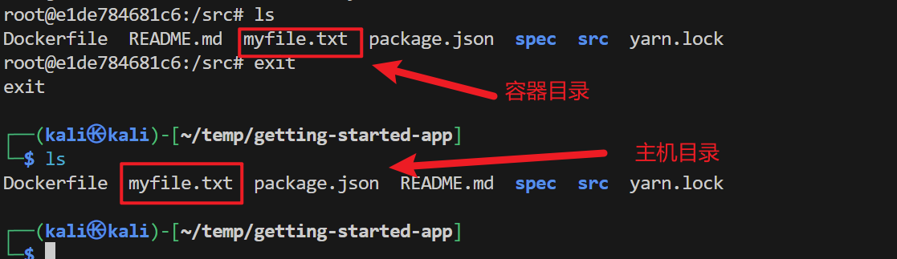
```
# 8. 从主机中删除⽂件 myfile.txt。
```

```
# 9. 在容器中，再次列出 app ⽬录的内容。观察⽂件现在不⻅了。
root@ac1237fad8db:/src# ls
# Dockerfile node_modules package.json spec src yarn.lock
```
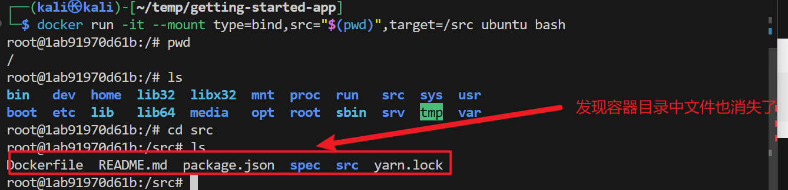
```
# 10. 使⽤ Ctrl + D 停⽌交互式容器会话。

```
#### 步骤二：构建一个使用绑定挂载的开发容器
```
# 1. 确保当前没有任何 getting-started 正在运⾏的容器。
# 2. 从 getting-started-app ⽬录中运⾏以下命令。
docker run -dp 127.0.0.1:3000:3000 \
-w /app --mount type=bind,src="$(pwd)",target=/app \
node:18-alpine \
sh -c "yarn install && yarn run dev"
# -dp 127.0.0.1:3000:3000 - 和以前⼀样。在后台模式下运⾏并创建端⼝映
射
# -w /app - 设置“⼯作⽬录”或运⾏命令的当前⽬录
# --mount type=bind,src="$(pwd)",target=/app - 绑定将主机中的当前
⽬录挂载到容器中的 /app ⽬录中
# node:18-alpine - 要使⽤的镜像。请注意，这是 Dockerfile 中应⽤的基
础镜像
# sh -c "yarn install && yarn run dev" - 命令。使⽤ sh （alpine
没有 bash ） 启动⼀个 shell，然后运⾏ yarn install 以安装包，然后运⾏ yarn
run dev 以启动开发服务器。如果查看 package.json ，将看到 dev 脚本启动
nodemon。
```
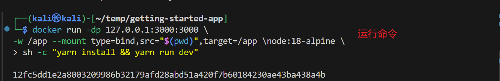
```
# 3. 使⽤ docker logs <container-id> 查看容器⽇志信息
```
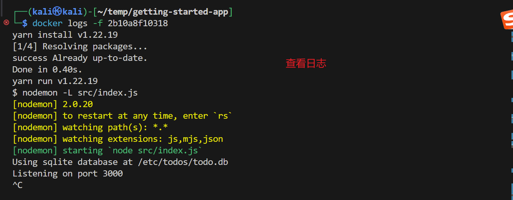
#### 步骤三：使用开发容器开发应用   
```
# 1. 在 src/static/js/app.js ⽂件的第 109 ⾏，将“Add Item”按钮更改
为简单地“Add”：
- {submitting ? 'Adding...' : 'Add Item'}
+ {submitting ? 'Adding...' : 'Add'}
```
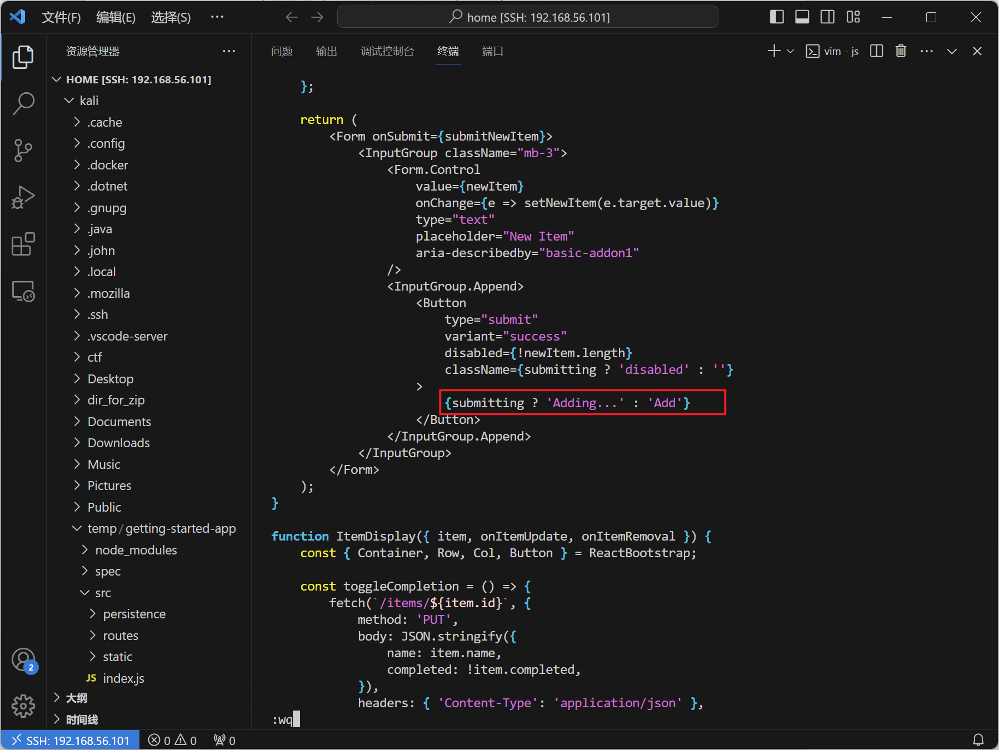
```
# 2. 在 Web 浏览器中刷新⻚⾯，由于绑定挂载，应该⼏乎⽴即看到更改。
Nodemon 检测到更改并重新启动服务器。节点服务器可能需要⼏秒钟才能重新启动。如果出现
错误，请尝试在⼏秒钟后刷新。
```
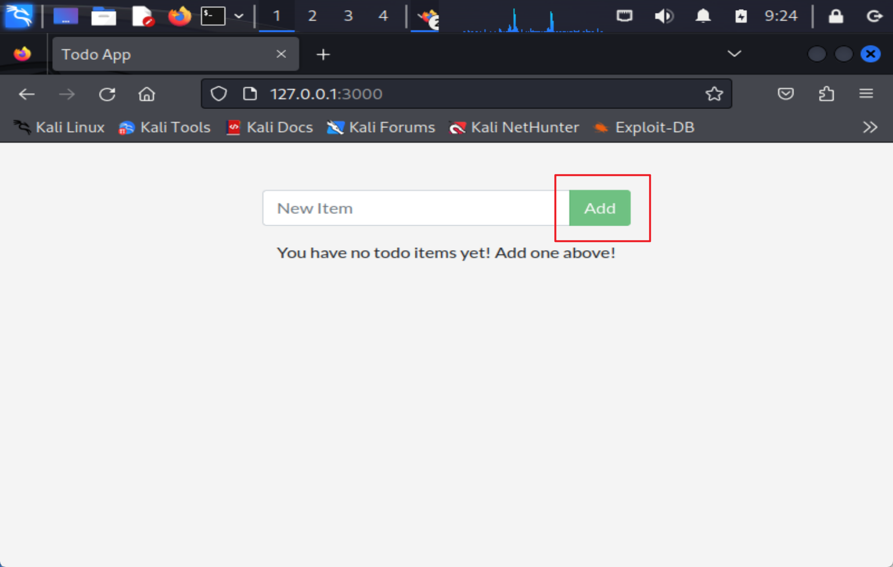
```
# 3. 请随意进⾏想要的任何其他更改。每次进⾏更改并保存⽂件时，由于绑定装
载，更改都会反映在容器中。当 Nodemon 检测到更改时，它会⾃动重新启动容器内的应⽤程序。
```
##### 以下为其他的修改效果，这里将new item 改为了new
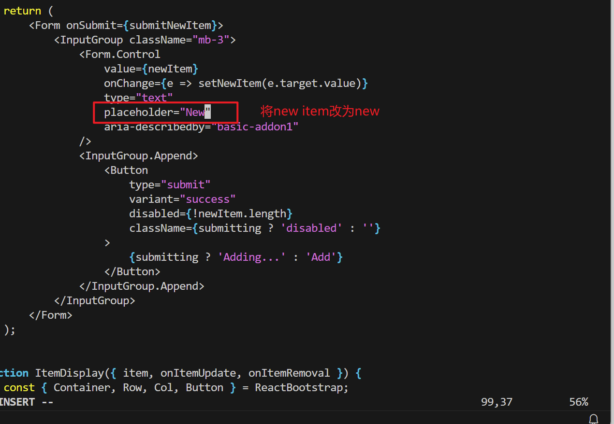
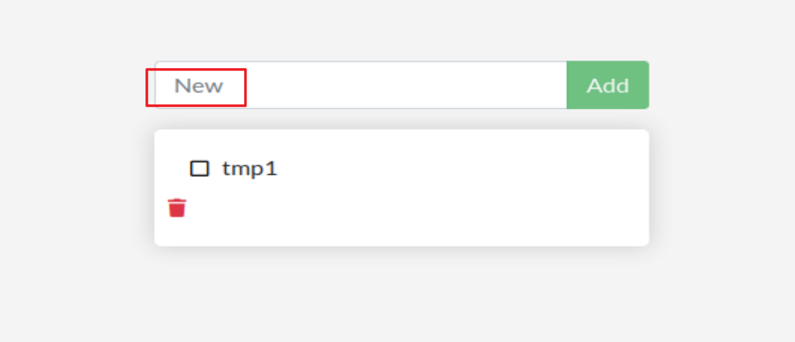

##### 参考文献：
* https://blog.csdn.net/qq359605040/article/details/129025958