# 第三章：基于容器技术的渗透测试靶场环境构建
## 实验一
#### 步骤一：启动MySQL
```
# 1. 创建⽹络
docker network create todo-app
```
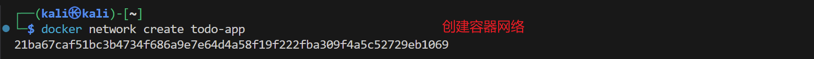
```
# 2. 启动 MySQL 容器并将其附加到⽹络。同时定义⼀些环境变量，数据库将使⽤
这些变量来初始化数据库。
# 命令中命名 todo-mysql-data 的卷，该卷挂载在 /var/lib/mysql ，这是
MySQL 存储其数据的位置。但是，我们从未运⾏过命令 docker volume create 。
Docker 会识别出要使⽤的命名卷，并⾃动创建⼀个。
docker run -d \
--network todo-app --network-alias mysql \
-v todo-mysql-data:/var/lib/mysql \
-e MYSQL_ROOT_PASSWORD=secret \
-e MYSQL_DATABASE=todos \
mysql:8.0
```
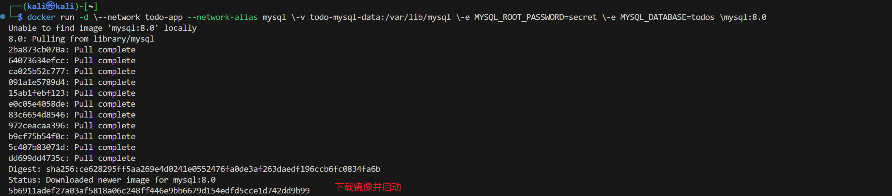
```
# 3. 若要确认数据库已启动并正在运⾏，请连接到数据库并验证它是否已连接。
# 当密码提示出现时，键⼊ secret 。在 MySQL shell 中，列出数据库并验证
是否看到该 todos 数据库。
docker exec -it <mysql-container-id> mysql -u root -p
mysql> SHOW DATABASES;
# 应该会看到如下所示的输出：
# +--------------------+
# | Database |
# +--------------------+
# | information_schema |
# | mysql |
# | performance_schema |
# | sys |
# | todos |
# +--------------------+
# 5 rows in set (0.00 sec)
# 4. 退出 MySQL shell 以返回到计算机上的 shell。
mysql> exit
# 我们拥有了⼀个 todos 数据库，可供使⽤。
```
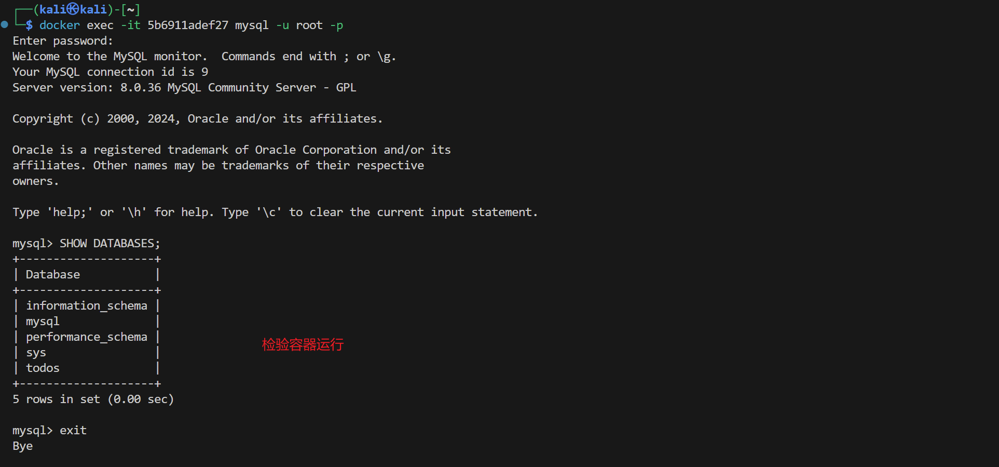
#### 步骤二：连接 MySQL
```
# 1. 使⽤ nicolaka/netshoot 镜像启动⼀个新容器。确保将其连接到同⼀⽹
络。
docker run -it --network todo-app nicolaka/netshoot
```
`安装`netshoot``
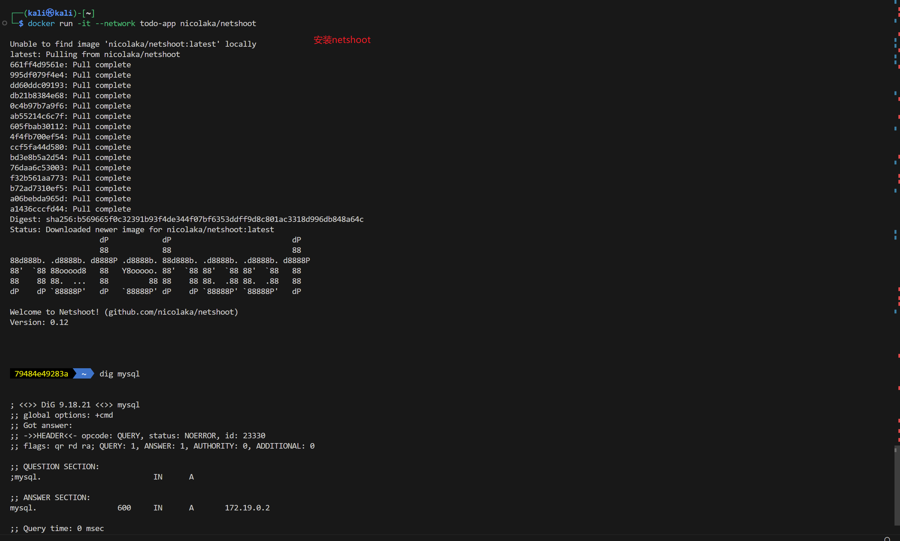
```
# 2. 在容器中，使⽤ dig 命令，这是⼀个有⽤的 DNS ⼯具。将查找主机名为
mysql 的 IP 地址。
dig mysql
# ; <<>> DiG 9.18.8 <<>> mysql
# ;; global options: +cmd
# ;; Got answer:
# ;; ->>HEADER<<- opcode: QUERY, status: NOERROR, id: 32162
# ;; flags: qr rd ra; QUERY: 1, ANSWER: 1, AUTHORITY: 0,
ADDITIONAL: 0
# ;; QUESTION SECTION:
# ;mysql. IN A
# ;; ANSWER SECTION:
# mysql. 600 IN A 172.23.0.2
# ;; Query time: 0 msec
# ;; SERVER: 127.0.0.11#53(127.0.0.11)
# ;; WHEN: Tue Oct 01 23:47:24 UTC 2019
# ;; MSG SIZE rcvd: 44
```
`查看解析IP`
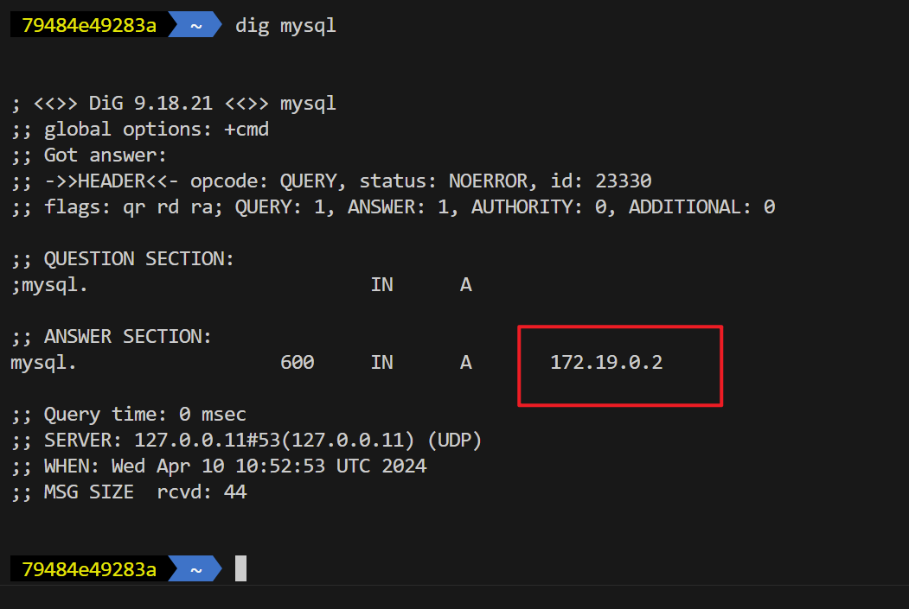
#### 步骤三：使 TODO 应用程序使用 MYSQL
```
# 1. 指定前⾯的每个环境变量，并将容器连接到应⽤⽹络。请确保在运⾏此命令时
位于⽬录中 getting-started-app。
docker run -dp 127.0.0.1:3000:3000 \
-w /app -v "$(pwd):/app" \
--network todo-app \
-e MYSQL_HOST=mysql \
-e MYSQL_USER=root \
-e MYSQL_PASSWORD=secret \
-e MYSQL_DB=todos \
node:18-alpine \
sh -c "yarn install && yarn run dev"
```
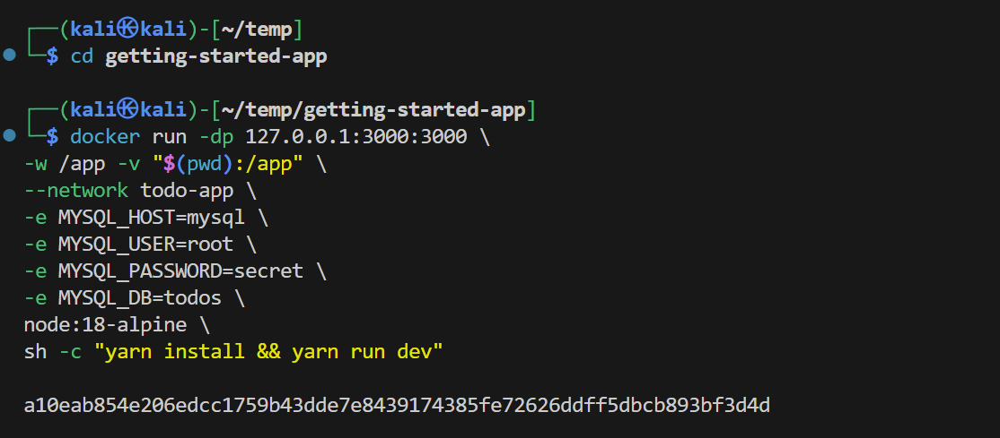

```
# 2. 查看容器⽇志，应该会看到类似于以下内容的消息，这表明它正在使⽤
mysql 数据库。
docker logs -f <container-id>
# nodemon src/index.js
# [nodemon] 2.0.20
# [nodemon] to restart at any time, enter `rs`
# [nodemon] watching dir(s): *.*
# [nodemon] starting `node src/index.js`
# Connected to mysql db at host mysql
# Listening on port 3000
```
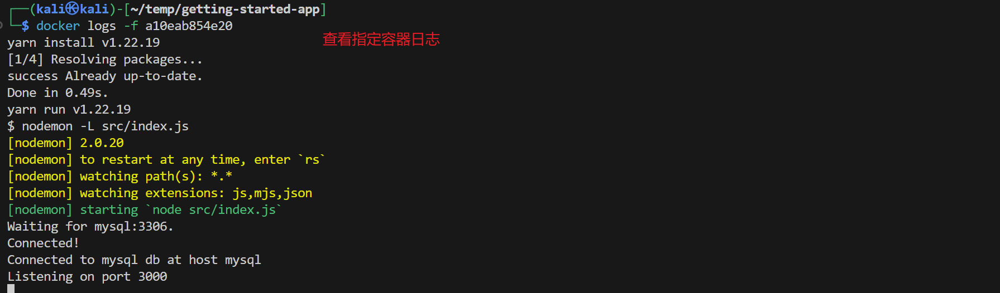

```
# 3. 在浏览器中打开应⽤程序，然后将⼀些项⽬添加到待办事项列表中。
```
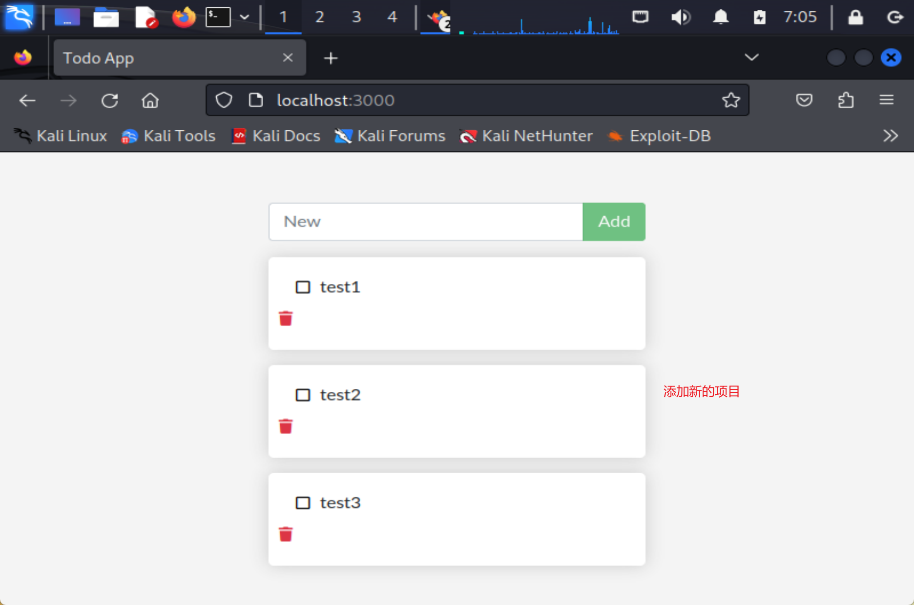
```
# 4. 连接到 mysql 数据库并证明项⽬正在写⼊数据库。密码是 secret.
docker exec -it <mysql-container-id> mysql -p todos
```
首先查看容器ID号
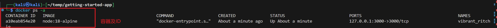
根据ID号进行操作进入数据库
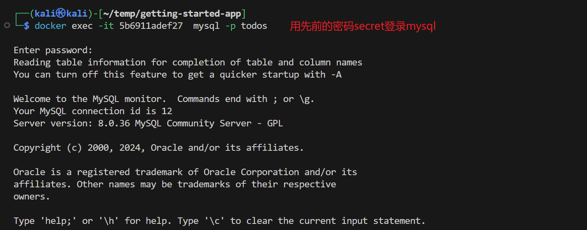
```
# 5. 在 mysql shell 中，运⾏以下命令：
mysql> select * from todo_items;
```
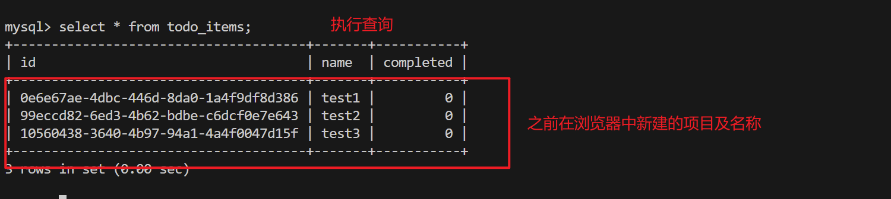
## 实验二
#### 步骤一：创建 Compose 文件
```
在目录中 getting-started-app ，创建名为 compose.yaml 的文件。

├── getting-started-app/
│ ├── Dockerfile
│ ├── compose.yaml
│ ├── node_modules/
│ ├── package.json
│ ├── spec/
│ ├── src/
│ └── yarn.lock

```
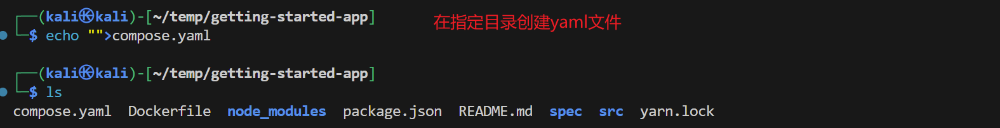

#### 步骤二：使用 Docker Compose 定义应用服务
```
1. 在文本或代码编辑器中打开 compose.yaml，首先定义要作为应用程序的一
部分运行的第一个服务（或容器）的名称和镜像。该名称将自动成为网络
别名，这在定义MySQL服务时非常有用。
services:
  app:
    image: node:18-alpine

```
```
2. 添加 command 到你的 compose.yaml 文件中。
services:
  app:
    image: node:18-alpine
    command: sh -c "yarn install && yarn run dev"
```
```
3. 通过 ports 定义转发的端口。
services:
  app:
    image: node:18-alpine
    command: sh -c "yarn install && yarn run dev"
    ports:
      - 127.0.0.1:3000:3000
```
```
4. 接下来，使用 working_dir 定义工作目录（-w /app），使用 volumes 定义
卷映射（-v "$(pwd):/app"）。Docker Compose 卷定义的一个优点是可以
使用当前目录中的相对路径。
services:
  app:
    image: node:18-alpine
    command: sh -c "yarn install && yarn run dev"
    ports:
      - 127.0.0.1:3000:3000
    working_dir: /app
    volumes:
      - ./:/app
```
```
5. 最后，我们需要使用 environment 定义环境变量。
services:
  app:
    image: node:18-alpine
    command: sh -c "yarn install && yarn run dev"
    ports:
      - 127.0.0.1:3000:3000
    working_dir: /app
    volumes:
      - ./:/app
    environment:
      MYSQL_HOST: mysql
      MYSQL_USER: root
      MYSQL_PASSWORD: secret
      MYSQL_DB: todos
```
#### 步骤三：使用 Docker Compose 定义 MySQL 服务
```
1. 首先定义新服务并命名它 mysql ，以便它自动获取网络别名。还要指定要
使用的映像。
services:
  app:
    # The app service definition
  mysql:
    image: mysql:8.0
```
```
2. 接下来，定义卷映射。当使用 docker run 运行容器时，Docker 会自动创建
命名卷。但是，使用 Compose 运行时不会发生这种情况。我们需要在顶级
volumes 部分定义卷，然后在服务配置中指定挂载点。只需提供卷名，即
可使用默认选项。
services:
  app:
    # The app service definition
  mysql:
    image: mysql:8.0
    volumes:
      - todo-mysql-data:/var/lib/mysql
volumes:
  todo-mysql-data:
```
```
3. 最后，我们需要指定环境变量。
services:
  app:
    # The app service definition
  mysql:
    image: mysql:8.0
    volumes:
      - todo-mysql-data:/var/lib/mysql
    environment:
      MYSQL_ROOT_PASSWORD: secret 
      MYSQL_DATABASE: todos
volumes:
  todo-mysql-data:
所以我们最终完整的 compose.yaml 应如下所示：
services:
  app:
    image: node:18-alpine
    command: sh -c "yarn install && yarn run dev"
    ports:
      - 127.0.0.1:3000:3000
    working_dir: /app
    volumes:
      - ./:/app
    environment:
      MYSQL_HOST: mysql
      MYSQL_USER: root
      MYSQL_PASSWORD: secret
      MYSQL_DB: todos
  mysql:
    image: mysql:8.0
    volumes:
      - todo-mysql-data:/var/lib/mysql
    environment:
      MYSQL_ROOT_PASSWORD: secret 
      MYSQL_DATABASE: todos
volumes:
  todo-mysql-data:

```
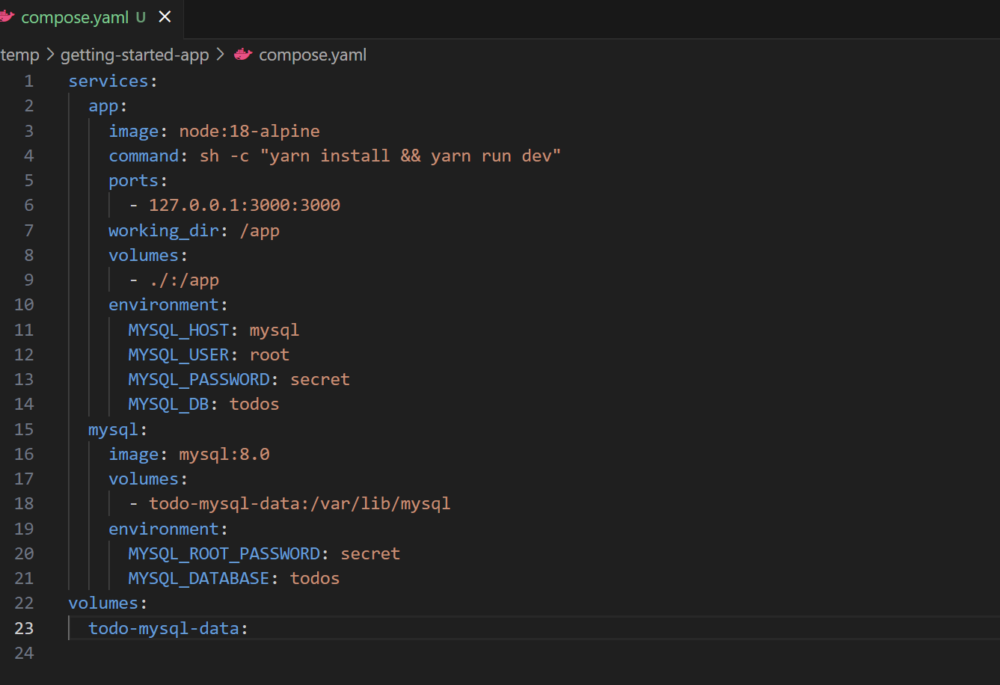
#### 步骤四：运行应用程序堆栈
```
# 1. 确保没有容器的其他副本⾸先运⾏。⽤于 docker ps 列出容器并 docker
rm -f <ids> 删除它们。
```
```
# 2. 使⽤命令 docker compose up 启动应⽤程序堆栈。添加 -d 标志以在后
台运⾏所有内容。
docker compose up -d
# 运⾏上⼀个命令时，应看到如下所示的输出：
# Creating network "app_default" with the default driver
# Creating volume "app_todo-mysql-data" with default driver
# Creating app_app_1 ... done
# Creating app_mysql_1 ... done
# 可以注意到 Docker Compose 创建了卷和⽹络。默认情况下，Docker
Compose 会⾃动为应⽤程序堆栈创建⽹络（这就是未在 Compose ⽂件中定义⽹络的原因）。
```
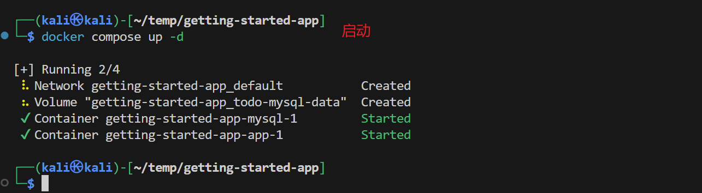

```
# 3. 使⽤命令 docker compose logs -f 查看⽇志。你将看到每个服务的⽇
志交错到⼀个流中。当你想观察与时间相关的问题时，这⾮常有⽤。该 -f 标志跟随⽇志，因
此将在⽣成时为您提供实时输出。
# 如果已运⾏该命令，则会看到如下所示的输出：
# mysql_1 | 2019-10-03T03:07:16.083639Z 0 [Note] mysqld:
ready for connections.
# mysql_1 | Version: '8.0.31' socket:
'/var/run/mysqld/mysqld.sock' port: 3306 MySQL Community Server
(GPL)
# app_1 | Connected to mysql db at host mysql
# app_1 | Listening on port 3000
```
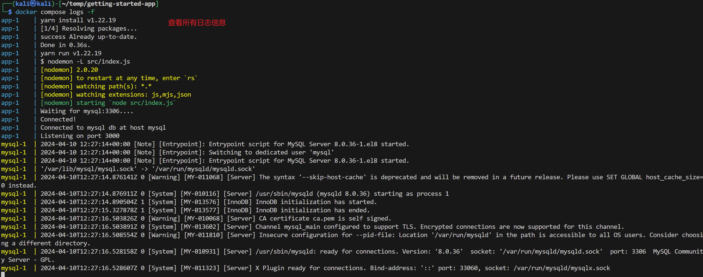

```
# 4. 服务名称显示在⾏⾸（通常为彩⾊），以帮助区分消息。如果要查看特定服务
的⽇志，可以在 logs 命令的末尾添加服务名称（例如， docker compose logs -f app
）。
```
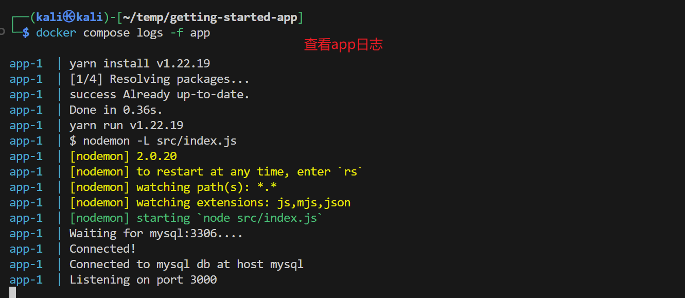

```
# 5. 在浏览器中打开 http://localhost:3000 并看到它正在运⾏。
```

#### 步骤五：关掉 Docker Compose
当准备好将其全部关掉时，只需运行 docker compose down。容器将停止，网络将
被删除。
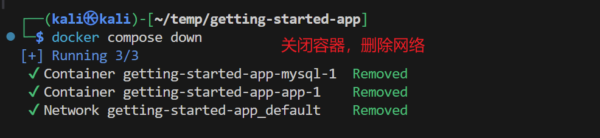